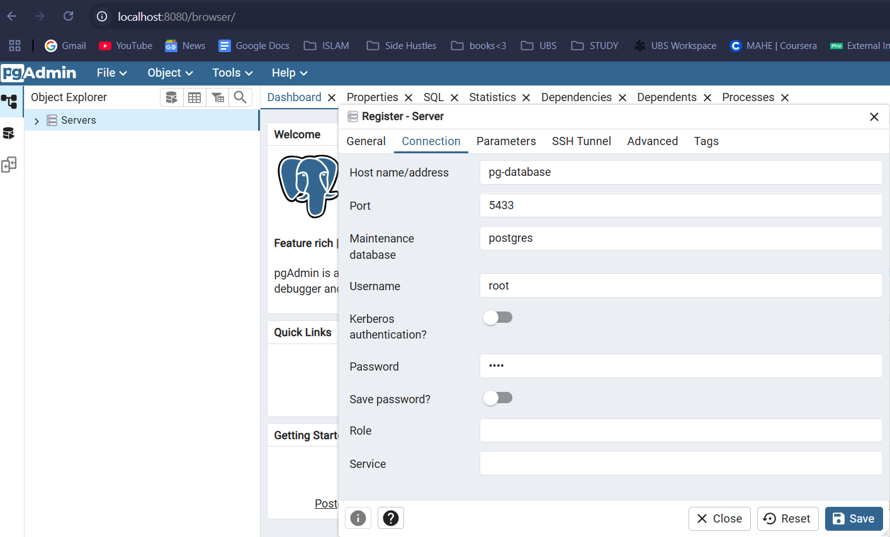
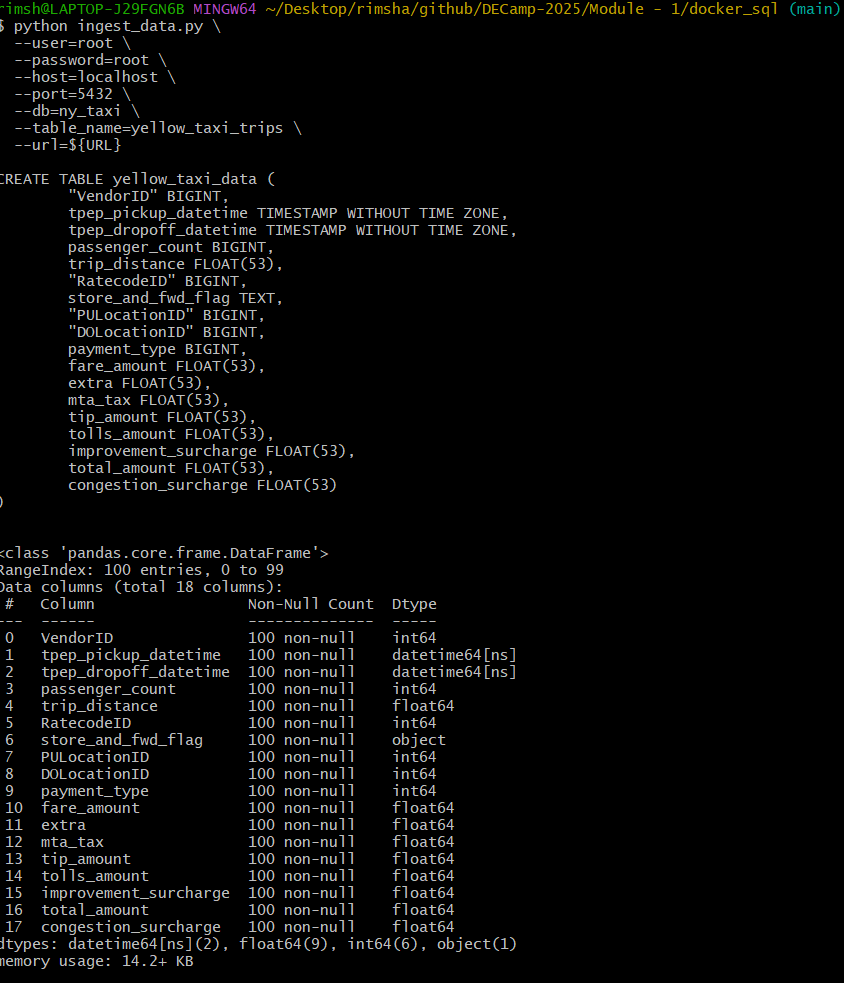

## Table of Contents
- [Intro to Docker](#de-zoomcamp-121---introduction-to-docker)
- [Ingesting Data into Postgres (pandas+pgcli)](#de-zoomcamp-122---ingesting-ny-taxi-data-to-postgres)
- [Connecting to Postgres with pgAdmin](#de-zoomcamp-123---connecting-pgadmin-and-postgres)
- [Dockering data ingestion in Postgres](#de-zoomcamp-124---dockerizing-the-ingestion-script)
- [Creating and running docker-compose](#de-zoomcamp-125---running-postgres-and-pgadmin-with-docker-composes)
- [Running SQL queries in pgAdmin](#de-zoomcamp-126---sql-refreshser)


### DE Zoomcamp 1.2.1 - Introduction to Docker 

[YT link](https://www.youtube.com/watch?v=EYNwNlOrpr0&list=PL3MmuxUbc_hJed7dXYoJw8DoCuVHhGEQb&index=6)


Docker - delivers software in containers.
You can run data pipelines in docker - based on what the dependencies are.. you can use/customize different containers. You don't have to install anything on the Host Computer. 
Ex. You can run PostgreSQL DB within/inside docker, and it will not interfere with the DB installed in your computer/ or other DB's running in the same pipeline-container. 

Docker image - snapshot of your container 
Kubernetes (K8s) is an open source system to deploy, scale, and manage containerized applications anywhere.
You can run the image in GC Kubernetes, AWS Batch etc. 

Why use Docker?
- Reproducible.
- Serverless 
- Local experimentation 

Example - Running a dockerfile - specifying dependency which is pandas (since python:3.9 in dockerhub doesn't contain the pandas library)

docker run -it --entrypoint=bash python:3.9 
''' opens bash
ls to check for all the files in the container.. can install libs needed. 
if you type "python" - you'll get py prompt again  
import pandas 
pandas.__version__ prints pandas version -> installation confirmed'''

when you exit and rerun above command, pandas is lost, so you create your own Dockerfile, hence a custom image containing the pandas lib. (Module 1/docker_sql/Dockerfile) 

docker build -t sample:1.0 . 

above command runs a docker image  
(.) specifies the directory (current)
and runs the dockerfile found in that folder - naming the image sample:1.0 (tag-version). 


first command to build Dockerfile that performs simple base run of python:3.9 and install pandas 
second command to build Dockerfile that runs the sample-pipeline.py (simple py code) as well. 


notice the app folder created inside container as per instructions provided in the Dockerfile 

```Note:
- WORKDIR ~ cd 
- Docker Commands:
    - docker images - display all images 
    - docker ps  - display all containers
    - docker desktop start 
    - docker desktop end 
    - docker pull {name}:{tag} - to download an image 
    - docker build -t/--tag {name}:{tag} - to "build" the Dockerfile, i.e. create docker image file 
        - "-t/--tag" to name the docker image
    - docker run -d --name {name}:{tag} - to run the container 
        - "-d" detaches the container from cmd line, so exiting will not close the container
        - "--name" to set a name for the container
    - docker start {container_id}/{container_name}
    - docker stop {container_id}/{container_name}```

- You can always do docker run without docker pull, because if the image is not found locally, it will automatically download it from the registry. 
- Running docker ps will giive you container_id and container_name


### DE Zoomcamp 1.2.2 - Ingesting NY Taxi Data to Postgres

[YT Link](https://www.youtube.com/watch?v=2JM-ziJt0WI&list=PL3MmuxUbc_hJed7dXYoJw8DoCuVHhGEQb&index=6)

Docker Compose - Running multiple docker images. 

To run the Postgres container : 

docker run -it \
  -e POSTGRES_USER="root" \
  -e POSTGRES_PASSWORD="root" \
  -e POSTGRES_DB="ny_taxi" \
  -v "C:\Users\rimsh\Desktop\rimsha\github\DECamp-2025\Module - 1\docker_sql\ny_taxi_data:/var/lib/postgresql/data" \
  -p 5432:5432 \
  postgres:13

-e to set env variables 
-v to perform volume mapping - host computer's folder mapped to container folder 
-p 5432 is the std port. it's the same in the host and container.. they're mapped. 

**Remember to run this in an empty directory because postgres initializes the database in the local location provided and hence, expects the folder to be empty. If not, it doesn't initialize db files to avoid corruption/overwriting existing files, i.e id the local folder was docker_sql, the command will throw an error.**

I was unable to run pgcli -h localhost -p 5432 -u root -d ny_taxi command - the connection kept failing because of incorrect password (root - as specified in the docker run command above for postgres).
Solutions tried:
1. Used the flag --no-password to avoid the prompt
2. Modified the file pg_hba.conf to set authentication to trust
3. Changed the password for "root" in the Postgres shell using ALTER.

None of the above solutions worked, finally changed the local port that the container port was mapped to from the default 5432 to 5433 and re-ran the docker run command as below : 

```docker run -it \
  -e POSTGRES_USER="root" \
  -e POSTGRES_PASSWORD="root" \
  -e POSTGRES_DB="ny_taxi" \
  -v "C:\Users\rimsh\Desktop\rimsha\github\DECamp-2025\Module - 1\docker_sql\ny_taxi_data:/var/lib/postgresql/data" \
  -p 5433:5432 \
  postgres:13```

docker exec -it <container_id> bash
(execute postgres with bash^^)

pgcli -h localhost -p 5432 -u root -d ny_taxi 
- connection error 
The problem *probably* arose because of locally installed Postgres also running on the same port (but I tested this as well... it was not active.. wonder why I got the error then(?)) 
Solution:
- map port to 5433

Using pandas to ingest data + connect to db using sqlalchemy, psycopg2:
Notes:
    - create_engine() to connect to db. 
    - for generating schema - pd.io.sql.get_schema(df, name="yellow_taxi_data", con=engine)
    - dataset is large, so we'll read from downloaded csv file and write to sql in chunks -> df_tf = pd.read_csv("yellow_tripdata_2021-01.csv", iterator=True, chunksize=100000), df_tf is an iterator. 
    - using for loops, iterate through every chunk/item in the iterator and pass it to sql -> df.to_sql(name="yellow_taxi_data", con=engine, if_exists='append').


### DE Zoomcamp 1.2.3 - Connecting pgAdmin and Postgres

So, in the last vids we used pgcli but it's not very convenient, so we'll try to use pgAdmin instead. 
First course of action - we need [pgadmin container](https://hub.docker.com/r/dpage/pgadmin4/). 

```docker run -it \
    -e PGADMIN_DEFAULT_EMAIL="admin@admin.com" \
    -e PGADMIN_DEFAULT_PASSWORD="root" \
    -p 8080:80 \
    dpage/pgadmin4```

Now, we need to link these containers, because pgadmin container doesn't have postgres, so localhost connection fails on trying to create a server at localhost:8080. So, we create a network-- with both these containers. 

Create a network : docker create network <network_name>

```*docker create network pg_network*```

Once you've created a network, run the docker containers in that network. 

```docker run -it \
  -e POSTGRES_USER="root" \
  -e POSTGRES_PASSWORD="root" \
  -e POSTGRES_DB="ny_taxi" \
  -v "C:\Users\rimsh\Desktop\rimsha\github\DECamp-2025\Module - 1\docker_sql\ny_taxi_data:/var/lib/postgresql/data" \
  -p 5433:5432 \
  --network=pg-network \
  --name pg-database \
  postgres:13```

```docker run -it \
    -e PGADMIN_DEFAULT_EMAIL="admin@admin.com" \
    -e PGADMIN_DEFAULT_PASSWORD="root" \
    -p 8080:80 \
    --network=pg-network \
    --name pg-admin \
    dpage/pgadmin4```

Note: the --name flag is important when running postgres container after specifying the network because it's how pgAdmin recogizes postgres. 

Go to [http://localhost:8080](http://localhost:8080/browser/)
Register a server
**Connection > Hostname: pg-database (how pgAdmin recognizes postgres container)**


**change port to 5432, because you don't want the local port, you want the docker port**


### DE Zoomcamp 1.2.4 - Dockerizing the Ingestion Script

1. Convert jupyter nb to py file (named it ingest_data.py)

2. DROP TABLE yellow_taxi_data; from ny_taxi using pgAdmin4, as we're trying to add it again by running the below py file. 
    (Previous method was creating a jupyter notebook to read from a downloaded yellow_taxix.csv file and writing to postgres using sqlalchemy. How do we improve the process by implementing the steps below? We're dockering the script (along with postgres, and pgadmin) and creating one all-purpose pipeline) 

3. Modify ingest_data.py to standardize the method, create a pipeline file. Load data directly from the URL. 
    Input variables as cmd arguments 
    user = params.user
    password = params.password
    host = params.host 
    port = params.port 
    db = params.db
    table_name = params.table_name
    url = params.url
     
    Python run command in gitbash
    > $ URL="https://github.com/DataTalksClub/nyc-tlc-data/releases/download/yellow/yellow_tripdata_2021-01.csv.gz"

    > python ingest_data.py \
        --user=root \
        --password=root \
        --host=localhost \
        --port=5432 \
        --db=ny_taxi \
        --table_name=yellow_taxi_data \
        --url=${URL}

    *port is 5432 because we're connecting to docker*

    

4. Modify Dockerfile to install required dependencies (in the container now, as we're running ingest_data.py inside it as well) and change sample-pipeline.py to ingest_data.py.

5. Build the new docker image as ny_data_ingest:v0
    docker build -t ny_data_ingest:v0 . 

6. Run the docker container
    docker run -it \
    --network=pg-network \
        ny_data_ingest:v0 \
        --user=root \
        --password=root \
        --host=pg-database \
        --port=5432 \
        --db=ny_taxi \
        --table_name=yellow_taxi_data \
        --url=${URL}

I faced some error on running the ny_data_ingest:v0 image because the ingest_data.py script was throwing an error for a line that was not in the file. (?!) 

Steps undertaken:
- Check for the content in the app/ingest_data.py file inside the ny_data_ingest:v0 container. 
    1. **docker build --no-cache -t ny_ingest_data:v0 .** Build the img without cache overlays. 
    1. When running the docker run command, don't supply the parameters/args-- You can bypass this by running the below  
        **docker run --rm -it --entrypoint bash ny_ingest_data:v0**

    --rm : used to automatically remove the container after it stops running.

    --entrypoint : This will override the entrypoint in the Dockerfile and start a shell inside the container without running ingest_data.py, allowing you to manually check files and run commands.

    2. ls -l app/ 

    3. cat app/ingest_data.py 

    Confirmed the file is the correct one. 
- Check if network exists using: **docker network ps**
- Delete all containers using docker desktop or the **docker kill** command, rerun the images for postgres and pgadmin (within the pg-network)
- Setup the credentials for pgAdmin server in localhost:8080 
- Build and run the ny_data_ingest:v0 image normally. (refer to step 5 & 6 of the dockerization part). 
- Run **select count(*) from yellow_taxi_data** using pgadmin query tool to confirm whether all the chunks are updated.  


### DE Zoomcamp 1.2.5 - Running Postgres and pgAdmin with Docker-Compose

Now, we will run docker-compose to run the containers in one yaml file. 

1. Create docker-compose.yml file and define the two servies - pgadmin and postgres. 
    Note: Defining the services/containers in the same docker-compose file means they run in the same network by default. 
2. Stop the running postgres and pgadmin container using - docker stop <container_id>
3. Run **docker-compose up**
4. Set up server in pgadmin at localhost:8080, name the host as pgdatabase (as specified for postgres in docker-compose)

Other commands:
Running **docker-compose down** will remove the containers + network.
Running **docker-compose up -d** will run the docker-compose file in detach mode. We get the shell back. 

### DE Zoomcamp 1.2.6 - SQL Refreshser

Running SQL queries in pgAdmin after ingesting [taxi_zone_lookup.csv](https://github.com/DataTalksClub/nyc-tlc-data/releases/download/misc). 