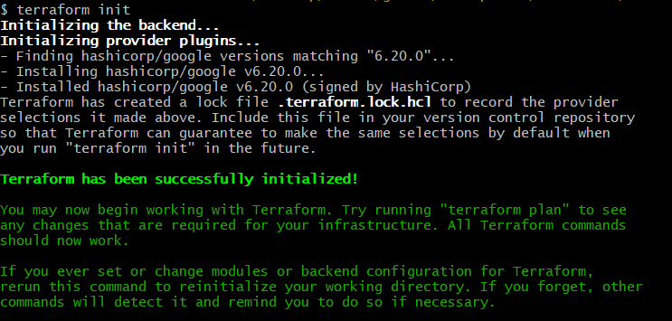

## Table of Contents
- [Intro Terraform](#de-zoomcamp-131---terraform-primer)
- [Some useful Terraform Commands](#terraform-commands)
- [Terraform Basics](#de-zoomcamp-132---terraform-basics)

### DE Zoomcamp 1.3.1 - Terraform Primer

Terraform is an IaaS/IaaC tool that helps you define/provision cloud and on-prem resources in a human-readable config file that you can version, reuse and share. 

#### Why Terraform?

- To keep track of avaiable infrastructural resources-- size of the disk, types of storage etc. 
- Easier collab, because it's defined in config files. 
- Reproducible, can be used in different application development projects with similar skeleton configs. You can change parameters defined and reuse as needed. 
- Ensures resources are removed once their use is done/are deallocated. 

#### What it doesn't do?

- It's not made to deloy, update software.. 
- Or modify resources (like OS type)
- It does not manage code on infrastructure. 
- Not used to manage resources not mentioned in the terraform config files.

#### What is a terraform provider?

Provider in Terraform is a plugin that enables interaction with an API. This includes Cloud providers and Software-as-a-service providers. The providers are specified in the Terraform configuration code, they allow Terraform to interact will different services, like AWS, GCP etc. (Check out Hashicorp Terraform registry)

#### Terraform Commands

* `terraform init`: initialize a working directory containing Terraform configuration files

* `terraform plan`: show changes Terraform will make to your infrastructure

* `terraform apply`: apply changes Terraform will make to your infrastructure

* `terraform destroy`: destroy all resources Terraform created

### DE Zoomcamp 1.3.2 - Terraform Basics

1. Set up Google cloud account. 

2. Go to the IAM and Admin panel, and create a service account. The new service account *terraform-runner* should get the following permissions: "Storage Admin", "BiqQuery Admin" and "Compute Admin". Add a key in the service account and download it a JSON file.
**Remember to include it in the .gitignore file** 

3. Install the HashiCorp Terraform extension in vscode.  

4. Create a `main.tf` file with a GCP provider configuration. Find the GCP provider [here](https://registry.terraform.io/providers/hashicorp/google/latest/docs). Use the default configuration found in the "Use Provider" panel, then copy the example code into the main.tf file.
    > provider "google" {
        project     = "my-project-id"
        region      = "us-central1"
    }
    > Copied config options from [here](https://registry.terraform.io/providers/hashicorp/google/latest/docs).
5. Use `terraform fmt` to format the code. Fetch the project id from the GCP console and replace the my-project-id placeholder in the main.tf file. Optionally search for the region closest to your location.

6. Download Google SDK for local setup
```
    Set environment variable to point to your downloaded GCP keys:
    export GOOGLE_CREDENTIALS="<path/to/your/service-account-authkeys>.json"
    echo $GOOGLE_CREDENTIALS

    # Refresh token/session, and verify authentication
    gcloud auth application-default login
```

7. Run terraform init on gitbash
    

8. Add the resource you want in the `main.tf` file, here we'll add google storage bucket and specify settings like lifecycle. 
    The demo-bucket is a variable to help us recognize what bucket we want to use. It doesn't have to be globally unique, but `name` does have to be (in GCP). 
    > Note: Lifecycle rule > action > type = "AbortIncompleteMultipartUpload" : This feature allows you to break down a large datafile in chunks and upload them to the bucker parallely. 
    Age is in days.  
    I saved `credentials` inside the `main.tf` block. 

9. Run `terraform plan` to display configurations and how they will be changed. 

10. Run `terraform apply` to run the changes/settings. This creates the `terraform.tfstate` file. 

11. Go to [console.cloud.google.com/](https://console.cloud.google.com/) and look for cloud storage, you'll see the storage bucket pop up there. 

12. If you run `terraform destroy`, your resources will be destroyed/deallocated. The state file will have no resources defined. The backup will be saved in an auto generated file `terraform.tfstate.backup`. 

>**Before uploading to GitHub**
>**Add a .gitignore file for the terraform config, e.g. this one from [here](https://github.com/github/gitignore/blob/main/Terraform.gitignore).**

### DE Zoomcamp 1.3.3 - Terraform Variables

1. Adding a new resource for BQ - [google_bigquery_dataset](https://registry.terraform.io/providers/hashicorp/google/latest/docs/resources/bigquery_dataset). Look at the config parameters and define the ones "required".  
>resource "google_bigquery_dataset" "demo_dataset" {
> dataset_id = "demo_dataset"
>}

3. Run `terraform plan` and `terraform apply`. 

What are Terraform Variables and why do we need them? 
Terraform variables are placeholders for values that you can use to make your configurations more dynamic and reusable.
- Clean code
- Reusability/Reproducability. 

``` Format : 
variable "variable_name" {
  description = "general description of the variable"
  default     = "variable_value"
}
```
You can also apply it with the command - `terraform apply -var variable_name="value"`