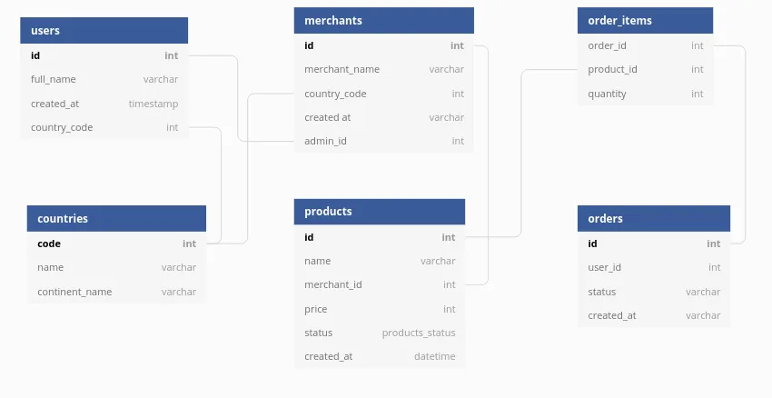
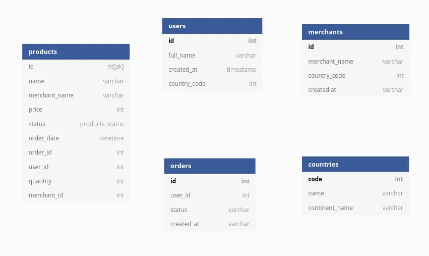
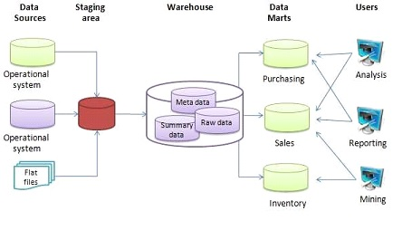
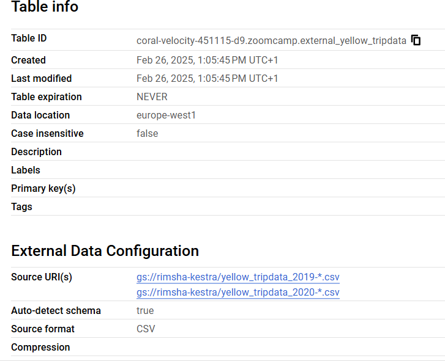
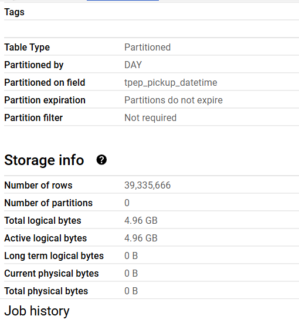
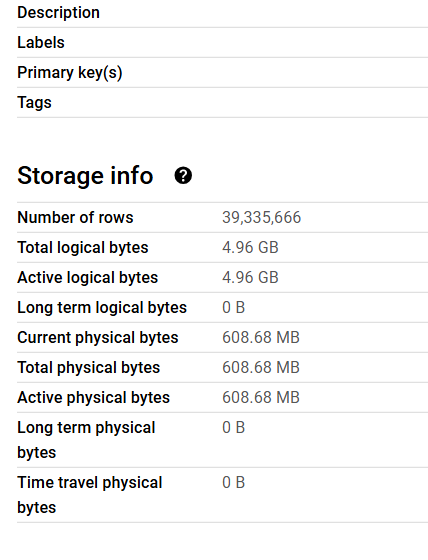
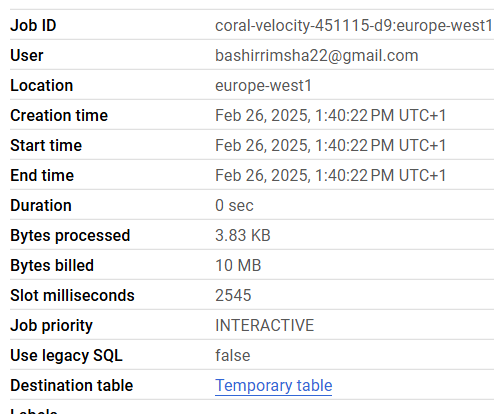
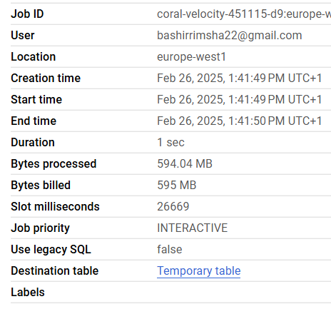
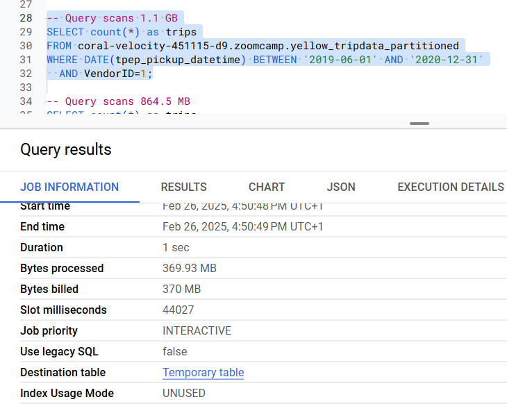
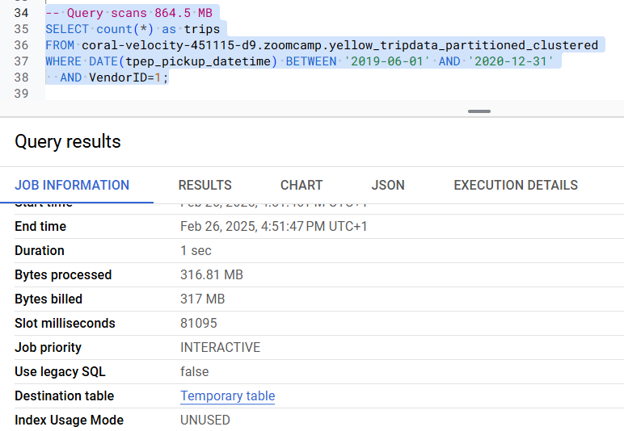

# Table of Contents 

- [Data Warehouse and BQ](#de-zoomcamp-311---data-warehouse-and-bigquery)
    - [OLTP v/s OLAP](#olap-vs-oltp)
    - [What is a Data Warehouse?](#what-is-a-data-warehouse)
        - [Database v/s Data Warehouse](#difference-between-database-and-data-warehouse)
    - [BigQuery](#bigquery-a-data-warehouse-solution)
    - [BigQuery Pricing](#bigquery-pricing)
    - [External Tables](#what-is-an-external-table)


## DE Zoomcamp 3.1.1 - Data Warehouse and BigQuery

### OLAP v/s OLTP 

|                     | OLTP                                                                                              | OLAP                                                                              |
|---------------------|---------------------------------------------------------------------------------------------------|-----------------------------------------------------------------------------------|
| Purpose             | Control and run essential business operations in real time                                        | Plan, solve problems, support decisions, discover hidden insights                 |
| Data updates        | Short, fast updates initiated by user                                                             | Data periodically refreshed with scheduled, long-running batch jobs               |
| Database design     | Normalized databases for efficiency                                                               | Denormalized databases for analysis                                               |
| Space requirements  | Generally small if historical data is archived                                                    | Generally large due to aggregating large datasets                                 |
| Backup and recovery | Regular backups required to ensure business continuity and meet legal and governance requirements | Lost data can be reloaded from OLTP database as needed in lieu of regular backups |
| Productivity        | Increases productivity of end users                                                               | Increases productivity of business managers, data analysts, and executives        |
| Data view           | Lists day-to-day business transactions                                                            | Multi-dimensional view of enterprise data                                         |
| User examples       | Customer-facing personnel, clerks, online shoppers                                                | Knowledge workers such as data analysts, business analysts, and executives        |

Denormalized DB:



Normalized DB:



### What is a Data Warehouse?

`Data Warehouse` is an **OLAP Solution**, whereas `Database` is generally an **OLTP Solution**. 



#### Difference between Database and Data Warehouse:

| Aspect         | Database (OLTP)                                      | Data Warehouse (OLAP)                           |
|----------------|------------------------------------------------------|-------------------------------------------------|
| Usage          | Best for small, atomic transactions                  | Best for complex business queries & analytics   |
| Users          | Supports thousands of concurrent users               | Handles a smaller number of users               |
| Availability   | 24/7/365 uptime required for business-critical tasks | Can tolerate scheduled downtime                 |
| Optimization   | Fast CRUD operations                                 | Optimized for complex queries on large datasets |
| Data Structure | Highly structured, normalized (no duplicates)        | Denormalized, optimized for read operations     |
| Data Freshness | Contains only up-to-date information                 | Stores extensive historical data for analysis   |

Data Warehouse can be broken down to `Data Marts` depending on context. 


### BigQuery: A Data Warehouse Solution

1. Serverless data warehouse 
    - There are no servers to manage or database software to install
2. Software as well as infrastructure including 
    - scalability and high-availability
3. Built-in features like 
    - machine learning
    - geospatial analysis
    - business intelligence
4. BigQuery maximizes flexibility by separating the compute engine that analyzes your data from your storage
    - When you have one server with storage and compute together, as the datasize increases your machine has to grow with it. 
      But BQ separates the two, i.e data is stored in `Google cloud storage`, which is vitual, unlimited and cost effective, and queries run on a `distributed compute engine` that can scale up and down based on demand. This essentially means that, you can store massive amounts of data without paying for constant compute resources. Since compute and storage are decoupled and billed separately, you only need to pay for queries that you run. On the other hand if they were coupled together, you'd have to pay based on your datasize and storage requirements even if your queries are idle.  

### BigQuery Pricing

BQ has two pricing models:
    - On demand: Based on amt of data processed, i.e 1TB = $5
    - Flat rate: Based on no. of pre-requested slots, i.e 100 slots = $2000/month = 400TB data processed.

When running queries on BQ, the top-right corner of the window will display an approximation of the size of the data that will be processed by the query. Once the query has run, the actual amount of processed data will appear in the Query results panel in the lower half of the window. This can be useful to quickly calculate the cost of the query.

### What is an External Table?

An external table in SQL is a table that allows you to query data stored outside of the database, without actually importing it. The data remains in its original location (e.g., cloud storage, data lakes, or distributed file systems), but the database system can still read and analyze it as if it were a normal table.

Example:

You can create an external table from a `CSV or Parquet file` stored in a Cloud Storage bucket:

```sql

CREATE OR REPLACE EXTERNAL TABLE `taxi-rides-ny.nytaxi.external_yellow_tripdata` 
OPTIONS (
  format = 'CSV',
  uris = ['gs://nyc-tl-data/trip data/yellow_tripdata_2019-*.csv', 'gs://nyc-tl-data/trip data/yellow_tripdata_2020-*.csv']
);
```

where `taxi-rides-ny.nytaxi.external_yellow_tripdata` is `projectname.dataset.table_name`


For more examples of how to create external tables with json, or python etc - click [here].(https://medium.com/@santosh_beora/external-tables-in-bigquery-a-beginners-guide-b76d9d080dbe)

Google BigQuery supports the following External Data Sources:

    - Bigtable
    - Cloud Panner
    - Cloud SQL
    - Cloud Storage
    - Drive

Google BigQuery has two basic mechanisms for querying External data sources which are:

    - External tables
    - Federated queries

| Feature         | External Tables                                                                                                 | Federated Queries                                                                                                                                     |
|-----------------|-----------------------------------------------------------------------------------------------------------------|-------------------------------------------------------------------------------------------------------------------------------------------------------|
| Definition      | A table that directly references external data sources (e.g., Google Cloud Storage) without importing the data. | A query that accesses and joins data across multiple sources, such as Cloud SQL, Bigtable, or even another BigQuery dataset, without moving the data. |
| Data Location   | Stored outside BigQuery (e.g., Google Cloud Storage in CSV, JSON, Parquet, ORC, or Avro formats).               | Can be in Cloud SQL (MySQL, PostgreSQL), Bigtable, Google Sheets, or another BigQuery dataset.                                                        |
| Query Method    | Queries are run against an external table definition.                                                           | Queries directly reference an external database or another dataset using EXTERNAL_QUERY().                                                            |
| Performance     | Slower than native BigQuery tables since data is read from storage on demand.                                   | Can be slower due to network overhead when querying remote databases.                                                                                 |
| Schema Handling | Schema must be defined manually or inferred from the external file.                                             | Schema is handled by the remote system (e.g., Cloud SQL) and doesn't need manual definition.                                                          |
| Write Support   | Read-only (data cannot be modified in external storage).                                                        | Read-only, but you can use federated queries to insert data into BigQuery tables.                                                                     |
| Example Usage   | Querying large files in Cloud Storage without loading them into BigQuery.                                       | Querying a Cloud SQL database or Google Sheets without importing the data.                                                                            |

For more info check - [Google BigQuery: External Tables Official Documentation](https://cloud.google.com/bigquery/docs/external-tables). 


### Partitions in BigQuery

Partitioning is a technique that divides a large table into smaller, manageable units (partitions) based on a specific columns inorder to improve query performance. There are four commonly used partitioning types in BQ:

| Partitioning Type              | How It Works                                                                                                     | Example Use Case                                                 |
|--------------------------------|------------------------------------------------------------------------------------------------------------------|------------------------------------------------------------------|
| Ingestion Time Partitioning    | Automatically partitions data based on the timestamp when it was inserted into BigQuery.                         | Log data, event tracking (e.g., partition by day: 2024-02-25).   |
| Column-Based Partitioning      | Partitions data based on a DATE, TIMESTAMP, or DATETIME column specified by the user.                            | Sales reports partitioned by sale_date.                          |
| Integer-Range Partitioning     | Partitions data based on an integer column, defining a range and interval.                                       | IoT sensor data partitioned by device_id (e.g., 0-100, 101-200). |
| Pseudo-Partitioning (Sharding) | Splits data across multiple tables manually (e.g., table_2023, table_2024). Not recommended due to inefficiency. | Legacy datasets that require table separation.                   |

Partition tables are very useful to improve performance and reduce costs, because BQ will not process as much data per query.

Here is an example for partitioning:

```sql
-- Create a non partitioned table from external table
CREATE OR REPLACE TABLE taxi-rides-ny.nytaxi.yellow_tripdata_non_partitioned AS
SELECT * FROM taxi-rides-ny.nytaxi.external_yellow_tripdata;

-- Create a partitioned table from external table
CREATE OR REPLACE TABLE taxi-rides-ny.nytaxi.yellow_tripdata_partitioned
PARTITION BY
  DATE(tpep_pickup_datetime) AS
SELECT * FROM taxi-rides-ny.nytaxi.external_yellow_tripdata;
```

```sql 
-- Impact of partition
-- Scanning 1.6GB of data
SELECT DISTINCT(VendorID)
FROM taxi-rides-ny.nytaxi.yellow_tripdata_non_partitioned
WHERE DATE(tpep_pickup_datetime) BETWEEN '2019-06-01' AND '2019-06-30';

-- Scanning ~106 MB of DATA
SELECT DISTINCT(VendorID)
FROM taxi-rides-ny.nytaxi.yellow_tripdata_partitioned
WHERE DATE(tpep_pickup_datetime) BETWEEN '2019-06-01' AND '2019-06-30';
```

To look into a Partition:

```sql 
SELECT table_name, partition_id, total_rows
FROM `nytaxi.INFORMATION_SCHEMA.PARTITIONS`
WHERE table_name = 'yellow_tripdata_partitioned'
ORDER BY total_rows DESC;
```
This query displays a table with tablename, partition id (dates partitioned on), and no. of rows in each partition. 

<details><summary>BQ Partitions</summary>


External Table Details (Q1) 

 

Partition Exec Details (Q2) 



Non-Partition Exec Details (Q3)



Parition Impact (Q4)



Non-Partition Impact (Q5)



</details>


### Clustering in BigQuery 

Clustering organizes data *within* partitions based on one or more columns for faster querying. It can improve performance and lower costs on big datasets for certain types of queries, such as queries that use filter clauses and queries that aggregate data.

> Note: tables with less than 1GB don't show significant improvement with partitioning and clustering; doing so in a small table could even > lead to increased cost due to the additional metadata reads and maintenance needed for these features.

Example:
```sql
-- Creating a partition and cluster table
CREATE OR REPLACE TABLE taxi-rides-ny.nytaxi.yellow_tripdata_partitioned_clustered
PARTITION BY DATE(tpep_pickup_datetime)
CLUSTER BY VendorID AS
SELECT * FROM taxi-rides-ny.nytaxi.external_yellow_tripdata;
```
Here, the date partitions are further divided/broken down into clusters by VendorID. 

<details>
<summary>BQ Clusters</summary>

Partitioned table: Query performance and data processed 



Clustered table: Query performance and data processed 



</details>


## DE Zoomcamp 3.1.2 - Partioning and Clustering