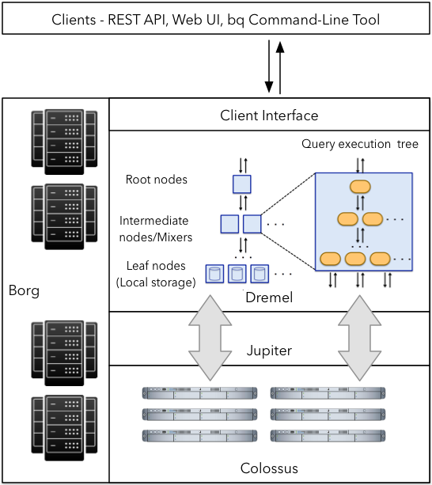

# Table of Contents 

- [Data Warehouse and BQ](#de-zoomcamp-311---data-warehouse-and-bigquery)
    - [OLTP v/s OLAP](#olap-vs-oltp)
    - [What is a Data Warehouse?](#what-is-a-data-warehouse)
        - [Database v/s Data Warehouse](#difference-between-database-and-data-warehouse)
    - [BigQuery](#bigquery-a-data-warehouse-solution)
    - [BigQuery Pricing](#bigquery-pricing)
    - [External Tables](#what-is-an-external-table)
    - [Partitions in BigQuery](#partitions-in-bigquery)
    - [Clustering in BigQuery](#clustering-in-bigquery)
- [Partiioning v/s Clustering](#de-zoomcamp-312---partioning-and-clustering)
- [BigQuery best practices](#de-zoomcamp-321---bigquery-best-practices)
- [Internals of BQ](#de-zoomcamp-322---internals-of-big-query)
    - [BigQuery Architecture](#bigquery-architecture)
- [Machine Learning using BigQuery](#de-zoomcamp-331---bigquery-machine-learning)
- [ML model deployment](#de-zoomcamp-332---bigquery-machine-learning-deployment)

## DE Zoomcamp 3.1.1 - Data Warehouse and BigQuery

### OLAP v/s OLTP 

|                     | OLTP                                                                                              | OLAP                                                                              |
|---------------------|---------------------------------------------------------------------------------------------------|-----------------------------------------------------------------------------------|
| Purpose             | Control and run essential business operations in real time                                        | Plan, solve problems, support decisions, discover hidden insights                 |
| Data updates        | Short, fast updates initiated by user                                                             | Data periodically refreshed with scheduled, long-running batch jobs               |
| Database design     | Normalized databases for efficiency                                                               | Denormalized databases for analysis                                               |
| Space requirements  | Generally small if historical data is archived                                                    | Generally large due to aggregating large datasets                                 |
| Backup and recovery | Regular backups required to ensure business continuity and meet legal and governance requirements | Lost data can be reloaded from OLTP database as needed in lieu of regular backups |
| Productivity        | Increases productivity of end users                                                               | Increases productivity of business managers, data analysts, and executives        |
| Data view           | Lists day-to-day business transactions                                                            | Multi-dimensional view of enterprise data                                         |
| User examples       | Customer-facing personnel, clerks, online shoppers                                                | Knowledge workers such as data analysts, business analysts, and executives        |

Denormalized DB:


Normalized DB:


### What is a Data Warehouse?

`Data Warehouse` is an **OLAP Solution**, whereas `Database` is generally an **OLTP Solution**. 


#### Difference between Database and Data Warehouse:

| Aspect         | Database (OLTP)                                      | Data Warehouse (OLAP)                           |
|----------------|------------------------------------------------------|-------------------------------------------------|
| Usage          | Best for small, atomic transactions                  | Best for complex business queries & analytics   |
| Users          | Supports thousands of concurrent users               | Handles a smaller number of users               |
| Availability   | 24/7/365 uptime required for business-critical tasks | Can tolerate scheduled downtime                 |
| Optimization   | Fast CRUD operations                                 | Optimized for complex queries on large datasets |
| Data Structure | Highly structured, normalized (no duplicates)        | Denormalized, optimized for read operations     |
| Data Freshness | Contains only up-to-date information                 | Stores extensive historical data for analysis   |

Data Warehouse can be broken down to `Data Marts` depending on context. 


### BigQuery: A Data Warehouse Solution

1. Serverless data warehouse 
    - There are no servers to manage or database software to install
2. Software as well as infrastructure including 
    - scalability and high-availability
3. Built-in features like 
    - machine learning
    - geospatial analysis
    - business intelligence
4. BigQuery maximizes flexibility by separating the compute engine that analyzes your data from your storage
    - When you have one server with storage and compute together, as the datasize increases your machine has to grow with it. 
      But BQ separates the two, i.e data is stored in `Google cloud storage`, which is vitual, unlimited and cost effective, and queries run on a `distributed compute engine` that can scale up and down based on demand. This essentially means that, you can store massive amounts of data without paying for constant compute resources. Since compute and storage are decoupled and billed separately, you only need to pay for queries that you run. On the other hand if they were coupled together, you'd have to pay based on your datasize and storage requirements even if your queries are idle.  

### BigQuery Pricing

BQ has two pricing models:
    - On demand: Based on amt of data processed, i.e 1TB = $5
    - Flat rate: Based on no. of pre-requested slots, i.e 100 slots = $2000/month = 400TB data processed.

When running queries on BQ, the top-right corner of the window will display an approximation of the size of the data that will be processed by the query. Once the query has run, the actual amount of processed data will appear in the Query results panel in the lower half of the window. This can be useful to quickly calculate the cost of the query.

### What is an External Table?

An external table in SQL is a table that allows you to query data stored outside of the database, without actually importing it. The data remains in its original location (e.g., cloud storage, data lakes, or distributed file systems), but the database system can still read and analyze it as if it were a normal table.

Example:

You can create an external table from a `CSV or Parquet file` stored in a Cloud Storage bucket:

```sql

CREATE OR REPLACE EXTERNAL TABLE `taxi-rides-ny.nytaxi.external_yellow_tripdata` 
OPTIONS (
  format = 'CSV',
  uris = ['gs://nyc-tl-data/trip data/yellow_tripdata_2019-*.csv', 'gs://nyc-tl-data/trip data/yellow_tripdata_2020-*.csv']
);
```

where `taxi-rides-ny.nytaxi.external_yellow_tripdata` is `projectname.dataset.table_name`


For more examples of how to create external tables with json, or python etc - click [here].(https://medium.com/@santosh_beora/external-tables-in-bigquery-a-beginners-guide-b76d9d080dbe)

Google BigQuery supports the following External Data Sources:

    - Bigtable
    - Cloud Panner
    - Cloud SQL
    - Cloud Storage
    - Drive

Google BigQuery has two basic mechanisms for querying External data sources which are:

    - External tables
    - Federated queries

| Feature         | External Tables                                                                                                 | Federated Queries                                                                                                                                     |
|-----------------|-----------------------------------------------------------------------------------------------------------------|-------------------------------------------------------------------------------------------------------------------------------------------------------|
| Definition      | A table that directly references external data sources (e.g., Google Cloud Storage) without importing the data. | A query that accesses and joins data across multiple sources, such as Cloud SQL, Bigtable, or even another BigQuery dataset, without moving the data. |
| Data Location   | Stored outside BigQuery (e.g., Google Cloud Storage in CSV, JSON, Parquet, ORC, or Avro formats).               | Can be in Cloud SQL (MySQL, PostgreSQL), Bigtable, Google Sheets, or another BigQuery dataset.                                                        |
| Query Method    | Queries are run against an external table definition.                                                           | Queries directly reference an external database or another dataset using EXTERNAL_QUERY().                                                            |
| Performance     | Slower than native BigQuery tables since data is read from storage on demand.                                   | Can be slower due to network overhead when querying remote databases.                                                                                 |
| Schema Handling | Schema must be defined manually or inferred from the external file.                                             | Schema is handled by the remote system (e.g., Cloud SQL) and doesn't need manual definition.                                                          |
| Write Support   | Read-only (data cannot be modified in external storage).                                                        | Read-only, but you can use federated queries to insert data into BigQuery tables.                                                                     |
| Example Usage   | Querying large files in Cloud Storage without loading them into BigQuery.                                       | Querying a Cloud SQL database or Google Sheets without importing the data.                                                                            |

For more info check - [Google BigQuery: External Tables Official Documentation](https://cloud.google.com/bigquery/docs/external-tables). 


### Partitions in BigQuery

Partitioning is a technique that divides a large table into smaller, manageable units (partitions) based on a specific columns inorder to improve query performance. Each partition is created based on the partitioning key. There are four commonly used partitioning types in BQ:

| Partitioning Type              | How It Works                                                                                                     | Example Use Case                                                 |
|--------------------------------|------------------------------------------------------------------------------------------------------------------|------------------------------------------------------------------|
| Ingestion Time Partitioning    | Automatically partitions data based on the timestamp when it was inserted into BigQuery.                         | Log data, event tracking (e.g., partition by day: 2024-02-25).   |
| Column-Based Partitioning      | Partitions data based on a DATE, TIMESTAMP, or DATETIME column specified by the user.                            | Sales reports partitioned by sale_date.                          |
| Integer-Range Partitioning     | Partitions data based on an integer column, defining a range and interval.                                       | IoT sensor data partitioned by device_id (e.g., 0-100, 101-200). |
| Pseudo-Partitioning (Sharding) | Splits data across multiple tables manually (e.g., table_2023, table_2024). Not recommended due to inefficiency. | Legacy datasets that require table separation.                   |

Partition tables are very useful to improve performance and reduce costs, because BQ will not process as much data per query.

Here is an example for partitioning:

```sql
-- Create a non partitioned table from external table
CREATE OR REPLACE TABLE taxi-rides-ny.nytaxi.yellow_tripdata_non_partitioned AS
SELECT * FROM taxi-rides-ny.nytaxi.external_yellow_tripdata;

-- Create a partitioned table from external table
CREATE OR REPLACE TABLE taxi-rides-ny.nytaxi.yellow_tripdata_partitioned
PARTITION BY
  DATE(tpep_pickup_datetime) AS
SELECT * FROM taxi-rides-ny.nytaxi.external_yellow_tripdata;
```

```sql 
-- Impact of partition
-- Scanning 1.6GB of data
SELECT DISTINCT(VendorID)
FROM taxi-rides-ny.nytaxi.yellow_tripdata_non_partitioned
WHERE DATE(tpep_pickup_datetime) BETWEEN '2019-06-01' AND '2019-06-30';

-- Scanning ~106 MB of DATA
SELECT DISTINCT(VendorID)
FROM taxi-rides-ny.nytaxi.yellow_tripdata_partitioned
WHERE DATE(tpep_pickup_datetime) BETWEEN '2019-06-01' AND '2019-06-30';
```

To look into a Partition:

```sql 
SELECT table_name, partition_id, total_rows
FROM `nytaxi.INFORMATION_SCHEMA.PARTITIONS`
WHERE table_name = 'yellow_tripdata_partitioned'
ORDER BY total_rows DESC;
```
This query displays a table with tablename, partition id (dates partitioned on), and no. of rows in each partition. 

<details><summary>BQ Partitions</summary>


External Table Details (Q1) 

 

Partition Exec Details (Q2) 


Non-Partition Exec Details (Q3)


Parition Impact (Q4)


Non-Partition Impact (Q5)


</details>


### Clustering in BigQuery 

Clustering *organizes* data based on one or more columns by sorting/grouping it in a way that stores alike column values together. It can improve performance and lower costs on big datasets for certain types of queries, such as queries that use filter clauses and queries that aggregate data.

> Note: tables with less than 1GB don't show significant improvement with partitioning and clustering; doing so in a small table could even > lead to increased cost due to the additional metadata reads and maintenance needed for these features.

Example:
```sql
-- Creating a partition and cluster table
-- DDL to define a cluster 
CREATE OR REPLACE TABLE taxi-rides-ny.nytaxi.yellow_tripdata_partitioned_clustered
PARTITION BY DATE(tpep_pickup_datetime)
CLUSTER BY VendorID AS
SELECT * FROM taxi-rides-ny.nytaxi.external_yellow_tripdata;
```

<details>
<summary>BQ Clusters</summary>

Partitioned table: Query performance and data processed 


Clustered table: Query performance and data processed 


</details>

Here, the Cluster groups together the VendorID's such that when specified in a where clause, BQ only has to go looking in that block of rows.  

## DE Zoomcamp 3.1.2 - Partioning and Clustering

As mentioned before, you may combine both partitioning and clustering in a table, but there are important differences between both techniques that you need to be aware of in order to decide what to use for your specific scenario:

|                                                          Clustering                                                         |                                          Partitioning                                          |
|:---------------------------------------------------------------------------------------------------------------------------:|:----------------------------------------------------------------------------------------------:|
| Cost benefit unknown. BQ cannot estimate the reduction in cost before running a query.                                      | Cost known upfront. BQ can estimate the amount of data to be processed before running a query. |
| High granularity. Multiple criteria can be used to sort the table.                                                          | Low granularity. Only a single column can be used to partition the table.                      |
| Clusters are "fixed in place".                                                                                              | Partitions can be added, deleted, modified or even moved between storage options.              |
| Benefits from queries that commonly use filters or aggregation against multiple particular columns.                         | Benefits when you filter or aggregate on a single column.                                      |
| Unlimited amount of clusters; useful when the cardinality of the number of values in a column or group of columns is large. | Limited to 4000 partitions; cannot be used in columns with larger cardinality.                 |


You may choose clustering over partitioning when partitioning results in a small amount of data per partition, when partitioning would result in over 4000 partitions or if your mutation operations modify the majority of partitions in the table frequently (for example, writing to the table every few minutes and writing to most of the partitions each time rather than just a handful).

BigQuery has automatic reclustering: when new data is written to a table, it can be written to blocks that contain key ranges that overlap with the key ranges in previously written blocks, which weaken the sort property of the table. BQ will perform automatic reclustering in the background to restore the sort properties of the table.

For partitioned tables, clustering is maintaned for data within the scope of each partition.


## DE Zoomcamp 3.2.1 - BigQuery Best Practices

Cost Reduction: 

- Avoid `Select *` and specify columns instead. 
- Price your queries before running. 
- Use clustering or partitioning.
- Use streaming inserts with caution. 
- Materialize queries in storage. 

Query Performance:

- Filter on partitioned columns.
- Denormalize data.
- Use [nested or repeated columns](https://cloud.google.com/blog/topics/developers-practitioners/bigquery-explained-working-joins-nested-repeated-data).

    Example: You can use nested fields to store related data, like multiple items in an order, within a single column rather than having separate rows for each item.
    ```sql
    CREATE TABLE `project.dataset.orders` (
    order_id STRING,
    customer_name STRING,
    items ARRAY<STRUCT<item_name STRING, quantity INT64, price FLOAT64>>
    );
    
    INSERT INTO `project.dataset.orders`
    VALUES ('order123', 'Alice', [STRUCT('item1', 2, 20.0), STRUCT('item2', 1, 30.0)]);
    ```
    Why it helps: By using nested and repeated fields, you avoid the need for joins and can query the related data directly in a single query.

- Use external data sources appropiately. Constantly reading from external sources like Cloud Storage incurs additional costs and slower performance. If you're reading a large dataset from Cloud Storage every time you run a query, consider caching or preloading the data into BigQuery if it's frequently used.

- Reduce data before using a `JOIN`. 

    Example: Instead of joining large tables and filtering later, apply filtering or aggregation before the join to reduce the data size.
    ```sql
    WITH filtered_orders AS (
    SELECT * FROM `project.dataset.orders`
    WHERE order_date >= '2025-01-01'
    )
    SELECT o.order_id, c.customer_name
    FROM filtered_orders o
    JOIN `project.dataset.customers` c
    ON o.customer_id = c.customer_id;
    ```
    Why it helps: Filtering out unnecessary data before performing a `JOIN` reduces the number of rows that need to be processed, improving performance.

- Do not treat `WITH` clauses as prepared statements/stored procedure.

    Example: Avoid reusing WITH clauses like this:
    ```sql
    WITH temp AS (
    SELECT * FROM `project.dataset.orders`
    WHERE order_date >= '2025-01-01'
    )
    SELECT * FROM temp;
    ```
    Why it helps: `WITH` clauses are meant for temporary results within a query, not for repeated execution like a stored procedure. BigQuery does not cache them automatically, and repeatedly querying the same data can lead to performance overhead.

- Avoid [oversharding](https://cloud.google.com/bigquery/docs/partitioned-tables#dt_partition_shard) tables.

    Why it helps: Too many small partitions increase overhead when BigQuery needs to manage and scan each partition. Using reasonable partitioning strategies improves performance and reduces costs.

- Avoid JavaScript user-defined functions.
    Example: Instead of using a JavaScript UDF to process strings, use BigQuery’s built-in STRING functions.
    ```sql

    -- Avoid this JavaScript UDF:
    CREATE FUNCTION project.dataset.uppercase(input STRING) AS
    """
    return input.toUpperCase();
    """;

    SELECT uppercase(name) FROM `project.dataset.users`;
    ``` 
    Why it helps: Native SQL functions are faster and more efficient than JavaScript UDFs. JavaScript UDFs incur additional costs and performance penalties.

- Use approximate aggregation functions rather than complete ones such as HyperLogLog++.
    Example: Instead of using COUNT(DISTINCT column) for large datasets, use the approximate version APPROX_COUNT_DISTINCT(column).
    ```sql
    SELECT APPROX_COUNT_DISTINCT(user_id) AS unique_users
    FROM `project.dataset.sessions`;
    ```
    Why it helps: Approximate functions are faster and use fewer resources compared to exact calculations, which is especially beneficial for large datasets.

- Order statements should be the last part of the query. Sorting is a computationally expensive operation. Applying `ORDER BY` at the end ensures that only the necessary data is sorted, improving performance.

- [Optimize join patterns](https://cloud.google.com/bigquery/docs/best-practices-performance-compute#optimize_your_join_patterns). Join the larger table first, then the smaller table.

- Place the table with the largest number of rows first, followed by the table with the fewest rows, and then place the remaining tables by decreasing size. Example: If you have orders with 100 million rows and customers with 1 million rows, place orders first in the join.Example: If you have orders with 100 million rows and customers with 1 million rows, place orders first in the join.

- This is due to how BigQuery works internally: the first table will be distributed evenly and the second table will be broadcasted to all the nodes. Check the Internals section in google cloud BQ docs for more details.

## DE Zoomcamp 3.2.2 - Internals of Big Query



### BigQuery Architecture

BigQuery is built on 4 infrastructure technologies:

1. **Dremel**: The compute part of BigQuery that executes SQL queries.
   - Dremel turns SQL queries into execution trees.
   - The leaves of these trees are called **slots** (responsible for reading data from storage and performing calculations).
   - The branches are called **mixers** (responsible for aggregation).
   - Dremel dynamically apportions slots to queries as needed, ensuring fairness for concurrent queries from multiple users.

2. **Colossus**: Google's global storage system.
   - BigQuery leverages a columnar storage format and compression algorithms to store data.
   - Colossus is optimized for reading large amounts of structured data.
   - Handles replication, recovery, and distributed management of data.

3. **Jupiter**: The network connecting Dremel and Colossus.
   - Jupiter is an in-house network technology created by Google to interconnect its data centers.

4. **Borg**: The orchestration solution that handles everything.
   - Borg is a precursor to Kubernetes and manages the deployment and operation of applications across Google's infrastructure.

## DE Zoomcamp 3.3.1 - BigQuery Machine Learning 

[YT LINK](https://www.youtube.com/watch?v=B-WtpB0PuG4&list=PL3MmuxUbc_hJed7dXYoJw8DoCuVHhGEQb&index=31)

BigQuery ML is a BQ feature which allows us to create and execute Machine Learning models using standard SQL queries, without additional knowledge of Python nor any other programming languages and without the need to export data into a different system.

The pricing for BigQuery ML is slightly different and more complex than regular BigQuery. Some resources are free of charge up to a specific limit as part of the Google Cloud Free Tier. You may check the current pricing in this link.

For more, watch the link above. 

## DE Zoomcamp 3.3.2 - BigQuery Machine Learning Deployment

[YT Link](https://www.youtube.com/watch?v=BjARzEWaznU&list=PL3MmuxUbc_hJed7dXYoJw8DoCuVHhGEQb&index=32)

ML models created within BQ can be exported and deployed to Docker containers running TensorFlow Serving.

