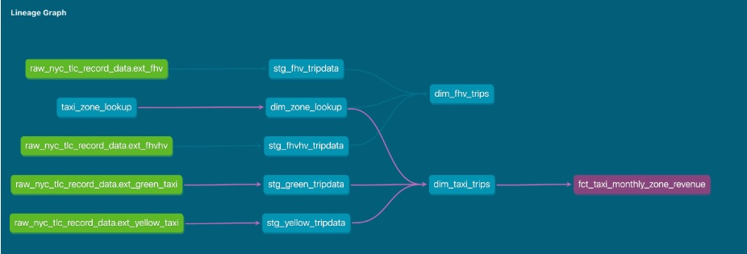
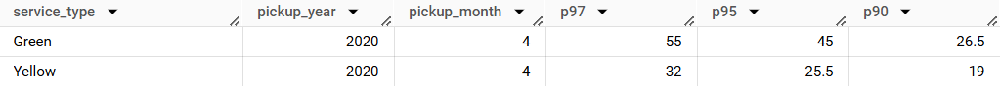
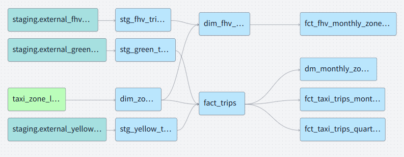
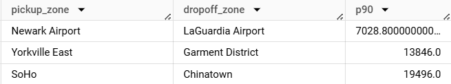
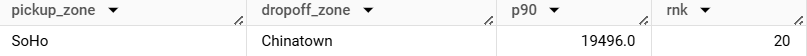

### Setup 

For the script to upload necessary files in GCS Bucket, click [here](upload_to_gcs.ipynb).

```sql
CREATE OR REPLACE EXTERNAL TABLE `coral-velocity-451115-d9.zoomcamp.external_yellow_tripdata_2019-2020` 
OPTIONS (
  format = 'CSV',
  uris = ['gs://rimsha-kestra/yellow/2019/yellow_tripdata_2019-*.csv', 'gs://rimsha-kestra/yellow/2020/yellow_tripdata_2020-*.csv']
);

CREATE OR REPLACE EXTERNAL TABLE `coral-velocity-451115-d9.zoomcamp.external_green_tripdata_2019-2020` 
OPTIONS (
  format = 'CSV',
  uris = ['gs://rimsha-kestra/green/2019/green_tripdata_2019-*.csv', 'gs://rimsha-kestra/green/2020/green_tripdata_2020-*.csv']
);

CREATE OR REPLACE EXTERNAL TABLE `coral-velocity-451115-d9.zoomcamp.external_fhv_tripdata_2019` 
OPTIONS (
  format = 'CSV',
  uris = ['gs://rimsha-kestra/fhv/2019/fhv_tripdata_2019-*.csv']
);
```
### Question 1: Understanding dbt model resolution

Provided you've got the following sources.yaml

```yaml
version: 2

sources:
  - name: raw_nyc_tripdata
    database: "{{ env_var('DBT_BIGQUERY_PROJECT', 'dtc_zoomcamp_2025') }}"
    schema:   "{{ env_var('DBT_BIGQUERY_SOURCE_DATASET', 'raw_nyc_tripdata') }}"
    tables:
      - name: ext_green_taxi
      - name: ext_yellow_taxi
```

with the following env variables setup where `dbt` runs:
```shell
export DBT_BIGQUERY_PROJECT=myproject
export DBT_BIGQUERY_DATASET=my_nyc_tripdata
```

What does this .sql model compile to?
```sql
select * 
from {{ source('raw_nyc_tripdata', 'ext_green_taxi' ) }}
```

- select * from dtc_zoomcamp_2025.raw_nyc_tripdata.ext_green_taxi
- select * from dtc_zoomcamp_2025.my_nyc_tripdata.ext_green_taxi
- <mark>select * from myproject.raw_nyc_tripdata.ext_green_taxi</mark>
- select * from myproject.my_nyc_tripdata.ext_green_taxi
- select * from dtc_zoomcamp_2025.raw_nyc_tripdata.green_taxi

**Solution:**

`raw_nyc_tripdata` is a source defined in this dbt project. It has two tables, `ext_green_taxi` and `ext_yellow_taxi` defined, both present in BQ under the project name `myproject` (if not defined, it will be `dtc_zoomcamp_2025`, the default value) and dataset `raw_nyc_tripdata` (since it's not exported, the default value will be set). 

The .sql model compiles to `select * from myproject.raw_nyc_tripdata.ext_green_taxi`


### Question 2: dbt Variables & Dynamic Models

Say you have to modify the following dbt_model (`fct_recent_taxi_trips.sql`) to enable Analytics Engineers to dynamically control the date range. 

- In development, you want to process only **the last 7 days of trips**
- In production, you need to process **the last 30 days** for analytics

```sql
select *
from {{ ref('fact_taxi_trips') }}
where pickup_datetime >= CURRENT_DATE - INTERVAL '30' DAY
```

What would you change to accomplish that in a such way that command line arguments takes precedence over ENV_VARs, which takes precedence over DEFAULT value?

- Add `ORDER BY pickup_datetime DESC` and `LIMIT {{ var("days_back", 30) }}`
- Update the WHERE clause to `pickup_datetime >= CURRENT_DATE - INTERVAL '{{ var("days_back", 30) }}' DAY`
- Update the WHERE clause to `pickup_datetime >= CURRENT_DATE - INTERVAL '{{ env_var("DAYS_BACK", "30") }}' DAY`
- <mark>Update the WHERE clause to `pickup_datetime >= CURRENT_DATE - INTERVAL '{{ var("days_back", env_var("DAYS_BACK", "30")) }}' DAY`</mark>
- Update the WHERE clause to `pickup_datetime >= CURRENT_DATE - INTERVAL '{{ env_var("DAYS_BACK", var("days_back", "30")) }}' DAY`

**Solution:**
 
```WHERE clause to `pickup_datetime >= CURRENT_DATE - INTERVAL '{{ var("days_back", env_var("DAYS_BACK", "30")) }}' DAY```

Here, the first check will be to see if `--var("days_back")`, which can be passed in the command line, will be checked. If the value has not been provided, the env variable `DAYS_BACK` will be checked, which is the right order of priority as defined in the question. 
 

### Question 3: dbt Data Lineage and Execution

Considering the data lineage below **and** that taxi_zone_lookup is the **only** materialization build (from a .csv seed file):



Select the option that does **NOT** apply for materializing `fct_taxi_monthly_zone_revenue`:

- dbt run
- dbt run --select +models/core/dim_taxi_trips.sql+ --target prod
- dbt run --select +models/core/fct_taxi_monthly_zone_revenue.sql
- <mark>dbt run --select +models/core/</mark>
- dbt run --select models/staging/+

**Solution:**

1. `dbt run` materializes/runs every model in the project (not seeds, snapshots etc - that's dbt build). 
2. `dbt run --select +models/core/dim_taxi_trips.sql+ --target prod` - runs `dim_taxi_trips.sql` and all its dependencies (upstream & downstream) in PROD.
3. `dbt run --select +models/core/fct_taxi_monthly_zone_revenue.sql` - Runs `fct_taxi_monthly_zone_revenue.sql` and all its upstream dependencies.
4. `dbt run --select +models/core/` - Runs all models inside models/core/ and their upstream dependencies.
5. `dbt run --select models/staging/+` - Runs all models inside models/staging/ and their downstream dependencies. Any models that depend on staging will run.

By this, we can conclude that `dbt run --select models/staging/+` will not materialize `fct_taxi_monthly_zone_revenue` as it is independent of models in `staging`. 

### Question 4: dbt Macros and Jinja

Consider you're dealing with sensitive data (e.g.: [PII](https://en.wikipedia.org/wiki/Personal_data)), that is **only available to your team and very selected few individuals**, in the `raw layer` of your DWH (e.g: a specific BigQuery dataset or PostgreSQL schema), 

 - Among other things, you decide to obfuscate/masquerade that data through your staging models, and make it available in a different schema (a `staging layer`) for other Data/Analytics Engineers to explore

- And **optionally**, yet  another layer (`service layer`), where you'll build your dimension (`dim_`) and fact (`fct_`) tables (assuming the [Star Schema dimensional modeling](https://www.databricks.com/glossary/star-schema)) for Dashboarding and for Tech Product Owners/Managers

You decide to make a macro to wrap a logic around it:

```sql


    
    

     {{- env_var(target_env_var) -}}
                        {{- env_var(stging_env_var, env_var(target_env_var)) -}}
    


```

And use on your staging, dim_ and fact_ models as:
```sql
{{ config(
    schema=resolve_schema_for('core'), 
) }}
```

That all being said, regarding macro above, **select all statements that are true to the models using it**:
- Setting a value for  `DBT_BIGQUERY_TARGET_DATASET` env var is mandatory, or it'll fail to compile - **TRUE**
- Setting a value for `DBT_BIGQUERY_STAGING_DATASET` env var is mandatory, or it'll fail to compile - **FALSE**
- When using `core`, it materializes in the dataset defined in `DBT_BIGQUERY_TARGET_DATASET` - **TRUE**
- When using `stg`, it materializes in the dataset defined in `DBT_BIGQUERY_STAGING_DATASET`, or defaults to `DBT_BIGQUERY_TARGET_DATASET` - **TRUE**
- When using `staging`, it materializes in the dataset defined in `DBT_BIGQUERY_STAGING_DATASET`, or defaults to `DBT_BIGQUERY_TARGET_DATASET` - **TRUE**


**Solution:**

Only the second option is False, because if the env variable `DBT_BIGQUERY_STAGING_DATASET` is null, the variable value in `DBT_BIGQUERY_TARGET_DATASET` will be used by default. The code will compile nonetheless.   


## Serious SQL

Alright, in module 1, you had a SQL refresher, so now let's build on top of that with some serious SQL.

These are not meant to be easy - but they'll boost your SQL and Analytics skills to the next level.  
So, without any further do, let's get started...

You might want to add some new dimensions `year` (e.g.: 2019, 2020), `quarter` (1, 2, 3, 4), `year_quarter` (e.g.: `2019/Q1`, `2019-Q2`), and `month` (e.g.: 1, 2, ..., 12), **extracted from pickup_datetime**, to your `fct_taxi_trips` OR `dim_taxi_trips.sql` models to facilitate filtering your queries


### Question 5: Taxi Quarterly Revenue Growth

1. Create a new model `fct_taxi_trips_quarterly_revenue.sql`

2. Compute the Quarterly Revenues for each year for based on `total_amount`
3. Compute the Quarterly YoY (Year-over-Year) revenue growth 
  * e.g.: In 2020/Q1, Green Taxi had -12.34% revenue growth compared to 2019/Q1
  * e.g.: In 2020/Q4, Yellow Taxi had +34.56% revenue growth compared to 2019/Q4

***Important Note: The Year-over-Year (YoY) growth percentages provided in the examples are purely illustrative. You will not be able to reproduce these exact values using the datasets provided for this homework.***

Considering the YoY Growth in 2020, which were the yearly quarters with the best (or less worse) and worst results for green, and yellow

- green: {best: 2020/Q2, worst: 2020/Q1}, yellow: {best: 2020/Q2, worst: 2020/Q1}
- green: {best: 2020/Q2, worst: 2020/Q1}, yellow: {best: 2020/Q3, worst: 2020/Q4}
- green: {best: 2020/Q1, worst: 2020/Q2}, yellow: {best: 2020/Q2, worst: 2020/Q1}
- <mark>green: {best: 2020/Q1, worst: 2020/Q2}, yellow: {best: 2020/Q1, worst: 2020/Q2}</mark>
- green: {best: 2020/Q1, worst: 2020/Q2}, yellow: {best: 2020/Q3, worst: 2020/Q4}

Solution:

1. Modify `fact_trips.sql` to add necessary dimensions:
    ```sql 
    .
    .
    EXTRACT(YEAR from pickup_datetime) as pickup_year, 
    EXTRACT(MONTH from pickup_datetime) as pickup_month, 
    EXTRACT(QUARTER from pickup_datetime) as pickup_qtr, 
    CONCAT(EXTRACT(YEAR from pickup_datetime), '/Q', EXTRACT(QUARTER from pickup_datetime)) as pickup_year_qtr,
    .
    .
    ```
    > Note: Everything in this model file remains the same as the file in `dbt_taxi_data` project, save for the addition of the few lines of code above to extract year, month, qtr, and year_qtr from `pickup_datetime`. 

2. Create a new model `fct_taxi_trips_quarterly_revenue.sql`:

    1. To compute the Quarterly Revenues for each year for based on `total_amount`
        ```sql
        {{ config(materialized="table") }}

        select 
            service_type, 
            pickup_year, 
            pickup_qtr, 
            sum(total_amount) as total_amount
        from {{ ref("fact_trips") }}
        where pickup_year in (2019,2020)
        group by service_type, pickup_year, pickup_qtr
        order by 1, 2, 3
        ```
        Output of this model query after running `dbt build --vars '{'is_test_run': 'false'}'` - [fct_taxi_trips_quarterly_revenue.sql - Result-1](Q5-1.csv) 

        > Note: Remember to set the `is_test_run: False` to get the full result. 

    2. To compute the Quarterly YoY (Year-over-Year) revenue growth:

        ```sql 
        {{ config(materialized="table") }}

        with
            cte as (
                select service_type, pickup_year, pickup_qtr, pickup_year_qtr, sum(total_amount) as total_revenue
                from {{ ref("fact_trips") }}
                where pickup_year in (2019, 2020)
                group by 1, 2, 3, 4
                order by 1, 2, 3
            )
        select
            curr.service_type,
            curr.pickup_year_qtr as cur_year_qtr,
            prev.pickup_year_qtr as prev_year_qtr,
            round(((curr.total_revenue - prev.total_revenue) / prev.total_revenue)*100,2) as YoY_Growth
        from cte as curr
        join
            cte as prev
            on curr.service_type = prev.service_type
            and curr.pickup_year = prev.pickup_year + 1
            and curr.pickup_qtr = prev.pickup_qtr
        order by curr.service_type, curr.pickup_year, curr.pickup_qtr
        ```

        Output of this model query - [fct_taxi_trips_quarterly_revenue.sql - Result-2](Q5-2.csv) 

The Answer is : `green: {best: 2020/Q1, worst: 2020/Q2}, yellow: {best: 2020/Q1, worst: 2020/Q2}`


### Question 6: P97/P95/P90 Taxi Monthly Fare

1. Create a new model `fct_taxi_trips_monthly_fare_p95.sql`
2. Filter out invalid entries (`fare_amount > 0`, `trip_distance > 0`, and `payment_type_description in ('Cash', 'Credit card')`)
3. Compute the **continous percentile** of `fare_amount` partitioning by service_type, year and and month

Now, what are the values of `p97`, `p95`, `p90` for Green Taxi and Yellow Taxi, in April 2020?

- green: {p97: 55.0, p95: 45.0, p90: 26.5}, yellow: {p97: 52.0, p95: 37.0, p90: 25.5}
- <mark>green: {p97: 55.0, p95: 45.0, p90: 26.5}, yellow: {p97: 31.5, p95: 25.5, p90: 19.0}</mark>
- green: {p97: 40.0, p95: 33.0, p90: 24.5}, yellow: {p97: 52.0, p95: 37.0, p90: 25.5}
- green: {p97: 40.0, p95: 33.0, p90: 24.5}, yellow: {p97: 31.5, p95: 25.5, p90: 19.0}
- green: {p97: 55.0, p95: 45.0, p90: 26.5}, yellow: {p97: 52.0, p95: 25.5, p90: 19.0}

**Solution:**

1. `fct_taxi_trips_monthly_fare_p95.sql` model 
    ```sql 
    {{ config(materialized="table") }}

    with
        filtered_entries as (
            select service_type, pickup_year, pickup_month, fare_amount
            from {{ ref("fact_trips") }}
            where
                fare_amount > 0
                and trip_distance > 0
                and payment_type_description in ('Cash', 'Credit card')
        )

    select
        service_type,
        pickup_year,
        pickup_month,
        approx_quantiles(fare_amount, 100)[offset(97)] as p97,
        approx_quantiles(fare_amount, 100)[offset(95)] as p95,
        approx_quantiles(fare_amount, 100)[offset(90)] as p90
    from filtered_entries
    group by service_type, pickup_year, pickup_month
    ```
    Build the project - `dbt build --vars '{'is_test_run': 'false'}'`

2. Run in BigQuery

    ```sql 
    select * from zoomcamp.fct_taxi_trips_monthly_fare_p95
    where pickup_year = 2020 and pickup_month = 4; 
    ```
**Output:**




### Question 7: Top #Nth longest P90 travel time Location for FHV

Prerequisites:
* Create a staging model for FHV Data (2019), and **DO NOT** add a deduplication step, just filter out the entries where `where dispatching_base_num is not null`
* Create a core model for FHV Data (`dim_fhv_trips.sql`) joining with `dim_zones`. Similar to what has been done [here](../dbt_taxi_data/models/core/fact_trips.sql)
* Add some new dimensions `year` (e.g.: 2019) and `month` (e.g.: 1, 2, ..., 12), based on `pickup_datetime`, to the core model to facilitate filtering for your queries

Now...
1. Create a new model `fct_fhv_monthly_zone_traveltime_p90.sql`
2. For each record in `dim_fhv_trips.sql`, compute the [timestamp_diff](https://cloud.google.com/bigquery/docs/reference/standard-sql/timestamp_functions#timestamp_diff) in seconds between dropoff_datetime and pickup_datetime - we'll call it `trip_duration` for this exercise
3. Compute the **continous** `p90` of `trip_duration` partitioning by year, month, pickup_location_id, and dropoff_location_id

For the Trips that **respectively** started from `Newark Airport`, `SoHo`, and `Yorkville East`, in November 2019, what are **dropoff_zones** with the 2nd longest p90 trip_duration ?

- <mark>LaGuardia Airport, Chinatown, Garment District</mark>
- LaGuardia Airport, Park Slope, Clinton East
- LaGuardia Airport, Saint Albans, Howard Beach
- LaGuardia Airport, Rosedale, Bath Beach
- LaGuardia Airport, Yorkville East, Greenpoint


**Solution:**

Pre-requisites:

1. Staging model for fhv data - `stg_fhv_tripdata.sql`
 
    ```sql
    {{ config(materialized="view") }}

    with
        fhv_tripdata as (
            select *
            from {{ source("staging", "external_fhv_tripdata_2019") }}
            where dispatching_base_num is not null
        )

    select
        dispatching_base_num,
        cast(pickup_datetime as timestamp) as pickup_datetime,
        cast(dropoff_datetime as timestamp) as dropoff_datetime,
        {{ dbt.safe_cast("PUlocationID", api.Column.translate_type("integer")) }}
        as pickup_locationid,
        {{ dbt.safe_cast("DOlocationID", api.Column.translate_type("integer")) }}
        as dropoff_locationid,
        SR_Flag as sr_flag,
        Affiliated_base_number as affiliated_base_number, 
    from fhv_tripdata
    ```

2. Core model for fhv data - `dim_fhv_trips.sql`

    ```sql 
    {{ config(materialized="table") }}

    with
        fhv_tripdata as (select * from {{ ref("stg_fhv_tripdata") }}),
        dim_zones as (select * from {{ ref("dim_zones") }} where borough != 'Unknown')

    select
        fhv.dispatching_base_num as dispatching_base_num,
        fhv.pickup_datetime as pickup_datetime,
        extract(year from fhv.pickup_datetime) as pickup_year,
        extract(month from fhv.pickup_datetime) as pickup_month,
        extract(quarter from fhv.pickup_datetime) as pickup_qtr,
        concat(
            extract(year from fhv.pickup_datetime),
            '/Q',
            extract(quarter from fhv.pickup_datetime)
        ) as pickup_year_qtr,
        fhv.dropoff_datetime as dropoff_datetime,
        fhv.pickup_locationid as pickup_locationid,
        fhv.dropoff_locationid as dropoff_locationid,
        dmz_pu.borough as pickup_borough,
        dmz_do.borough as dropoff_borough,
        dmz_pu.zone as pickup_zone,
        dmz_do.zone as dropoff_zone,
        dmz_pu.service_zone as pickup_service_zone,
        dmz_do.service_zone as dropoff_service_zone
    from fhv_tripdata as fhv
    inner join dim_zones as dmz_pu on fhv.pickup_locationid = dmz_pu.locationid
    inner join dim_zones as dmz_do on fhv.dropoff_locationid = dmz_do.locationid

    ```
**Lineage View:**



**Running the commands below as part of the deploy job:**
1. `dbt build --select +stg_fhv_tripdata+`
2. `dbt build --vars '{'is_test_run':'false'}'`

**BigQuery code:**

```sql 

WITH cte AS (
  SELECT pickup_zone, pickup_year, pickup_month, dropoff_zone, p90,
         DENSE_RANK() OVER (PARTITION BY pickup_zone 
                            ORDER BY p90 DESC) AS rnk
  FROM prod.fct_fhv_monthly_zone_traveltime_p90
  WHERE pickup_month = 11 AND pickup_year = 2019
)

SELECT distinct pickup_zone, dropoff_zone, p90 
FROM cte
where pickup_zone IN ('Newark Airport', 'SoHo', 'Yorkville East') and rnk = 2;
```

**Output:**



or alternatively, for each pickup zone, for example :

```sql 
WITH cte AS (
  SELECT pickup_zone, pickup_year, pickup_month, dropoff_zone, p90,
         DENSE_RANK() OVER (PARTITION BY pickup_zone 
                            ORDER BY p90 DESC) AS rnk
  FROM prod.fct_fhv_monthly_zone_traveltime_p90
)

SELECT distinct pickup_zone, dropoff_zone, p90, rnk
FROM cte
where pickup_zone = 'SoHo' and pickup_year = 2019 and pickup_month = 11
order by rnk
limit 1
offset 1;
```
**Output:**




<details><summary>Troubleshooting notes</summary>
I was unable to see the lineage of fhv tripdata models in prod dataset, even after running the deploy jobs (note that it would be available in the dev dataset - zoomcamp, but not in prod). Got node not found message on running dbt build. So, first, I modified the deploy job to run dbt build on +dim_fhv_trips+, still no luck. Then did the same but with the +stg_fhv_tripdata+ and it worked. ALl 10 models were found. 
</details>