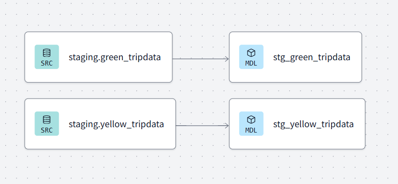
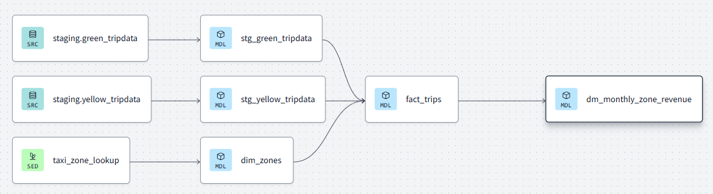
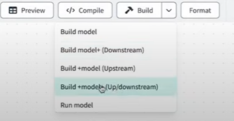
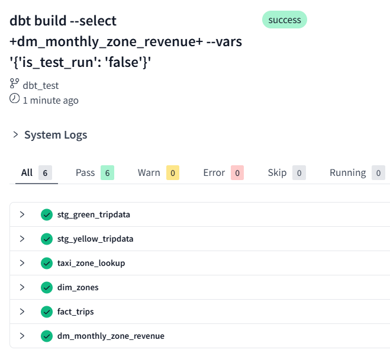

## Table of Contents
- [Intro to Analytics Engineering](#analytics-engineering-basics)
- [Data Modeling Concepts](#data-modeling-concepts)
    - [ETL v/s ELT](#etl-vs-elt)
    - [Dimensional Modeling](#kimballs-dimensional-modeling)
- [Intro to dbt](#intro-to-dbt)
    - [What is dbt?](#what-is-dbt)
    - [How does dbt work?](#how-does-dbt-work)
    - [How to use dbt?](#how-to-use-dbt)
- [Setting up dbt with bigquery](#setting-up-dbt-with-bigquery)
- [Setting up dbt with postgres](#start-your-dbt-with-postgres)
- [Development of dbt models](#development-of-dbt-models)
    - [Modular Data Modeling - Fact & Dimesions](#modular-data-modelling)
    - [Anatomy of a dbt model](#anatomy-of-a-dbt-model)
    - [Key concepts and setup of dbt models](#key-concepts-and-setup-of-dbt-models)
- [Developing staging models - Prelim processing](#developing-staging-models)
    - [Model Config file - schema.yml](#schemayml)
    - [Model 1 - stg_green_tripdata.sql](#model-1-stg_green_tripdatasql)
    - [Model 2 - stg_yellow_tripdata.sql](#model-1-stg_yellow_tripdatasql)
    - [Lineage View of Staging models](#lineage-view)
- [Developing Core Models - Fact & Dimensions]
- [Important Notes](#important-notes)
- [Troubleshooting](#troubleshooting-errors)


### Analytics Engineering Basics

[YT Link - DE Zoomcamp 4.1.2 - Analytics Engineering Basics](https://www.youtube.com/watch?v=uF76d5EmdtU&list=PL3MmuxUbc_hJed7dXYoJw8DoCuVHhGEQb&index=33)

In a traditional data team, we recognize the data engineer, the data analyst, and sometimes the data scientist. The data engineer prepares and maintains the infrastructure the data team needs. The data analyst uses the data hosted in that infrastructure to answer questions and solve problems.

With recent developments, data scientists and analysts are writing more code, but they are not trained as software engineers, and this is not their primary focus. Similarly, data engineers, while excellent software engineers, lack training in how the data is used by business users.

This gap is where the analytics engineer comes in. The role combines elements of the data engineer and the data analyst. It introduces good software engineering practices from the data engineer to the efforts of data analysts and scientists.

`Analytics Engineering` is an *inersection* of Data Analyst and Data Engineer. 


`Tools / Tech stack` an AE could be exposed to:


In this Module, we'll be focussing on `Data Modeling` and `Data Presentation`


### Data Modeling Concepts

#### **ETL v/s ELT**


In an ELT architecture, the Data Warehouse used for storage is also a `data transformation` tool, like BigQuery for example. This eradicates the need to find a medium to transform data, hence reducing costs and increasing operations and analysis flexibility.

#### Kimball's Dimensional Modeling

To understand Kimball’s approach to data modeling, we should begin by talking about the star schema. The star schema is a particular way of organizing data for analytical purposes. It consists of two types of tables:

A fact table, which acts as the primary table for the schema. A fact table contains the primary measurements, metrics, or ‘facts’ of a business process.
Many dimension tables associated with the fact table. Each dimension table contains `dimensions` — that is, descriptive attributes of the fact table.
These dimensional tables are said to `surround` the fact table, which is where the name `star schema` comes from.


The star schema is useful because it gives us a standardized, time-tested way to think about shaping your data for analytical purposes. It is:

- Flexible — it allows your data to be easily sliced and diced any which way your business users want to.
- Extensible — you may evolve your star schema in response to business changes.
- Performant — Kimball’s dimensional modeling approach was developed when the majority of analytical systems were run on relational database management systems (RDBMSes). The star schema is particularly performant on RDBMSes, as most queries end up being executed using the ‘star join’, which is a Cartesian product of all the dimensional tables.

Kimball's Dimensional Modeling is an approach to Data Warehouse design which focuses on 2 main points:

- Deliver data that is understandable to the business
- Deliver fast query performance
- Other goals such as reducing redundant data (prioritized by other approaches) are secondary. We are not going to focus heavily on making sure that data is not redundant; instead, we prioritize user understandability of this data and query performance.

Architecture of Dimensional Modeling

An analogy that is presented in Kimball's dimensional modeling is the kitchen analogy. The book compares how the data warehouse and the ETL process could be compared with a restaurant:

- `Staging Area`: Here, we have the raw data. This is not meant to be exposed to everyone but only to those who know how to use that raw data. In the case of a restaurant, this would be the food in its raw state before being processed.

- `Processing Area`: This is the kitchen in a restaurant. Here, raw data is processed and turned into data models. Again, this is limited to those who know how to do this, such as the cooks. The focus is on efficiency and ensuring standards are followed.

- `Presentation Area`: This is the dining hall and represents the final presentation of the data. Here, the data is exposed to business stakeholders.

### Intro to dbt (data build tool)

[YT Link - DE Zoomcamp 4.1.2 - What is dbt?](https://www.youtube.com/watch?v=gsKuETFJr54&list=PL3MmuxUbc_hJed7dXYoJw8DoCuVHhGEQb&index=34)

#### What is DBT?

dbt or data build tool is a transformation workflow that allows us to use SQL, or Python as well, to deploy analytical code. This code enables us to process all the data loaded from different sources. For example, in our case, we're using taxi data, but in a company setting, as a data engineer, you might work with data from backend systems, apps, frontend systems, or even third-party providers.

With dbt, anyone who knows how to write SQL SELECT statements has the power to build models, write tests, and schedule jobs to produce reliable, actionable datasets for analytics. The tool acts as an orchestration layer on top of your data warehouse and helps transform raw data into something meaningful and useful for the business or stakeholders. This transformed data could be consumed by BI tools or integrated into other workflows, such as machine learning pipelines.


#### How does dbt work?

In dbt, a model is essentially a SQL file where you write the logic to transform your data. For instance, if you have raw data in your data warehouse, you can create a model to apply transformations, clean it, and make it more structured and useful for analysis. A dbt model typically contains a SQL statement, such as a SELECT query, that defines how the data should be transformed.

A dbt model looks like this:

```sql
WITH
    orders as (select * from {{ref('orders')}}),
    line_items as (select * from {{ref('line_items')}})

SELECT
    id,
    sum(line_items.purchase_price)    

FROM orders
LEFT JOIN line_items ON orders.id = line_items.order_id

GROUP BY 1;
```


Here’s how it works step by step:

Selection of Raw Data: The SQL statement in your model pulls raw data from the source tables or external datasets in the data warehouse.

Transformation: The model applies transformations, such as filtering, aggregations, joins, or calculations, to clean and organize the raw data

Persistence: Once the data is transformed, dbt persists the results back into the data warehouse as a table or a view. A table is a physical dataset stored in the warehouse. A view is a virtual dataset that dynamically runs the transformation logic whenever queried.

#### How to use dbt?

There are two ways to use dbt

1. dbt cloud: SaaS application to develop and manage dbt projects.

    - Web-based IDE to develop, run and test a dbt project.
    - Jobs orchestration.
    - Logging and alerting.
    - Intregrated documentation.
    - Free for individuals (one developer seat).

2. dbt core: Open-source project that allows the data transformation.

    - Builds and runs a dbt project (.sql and .yaml files).
    - Includes SQL compilation logic, macros and database adapters.
    - Includes a CLI interface to run dbt commands locally.
    - Open-source and free to use.


There are two ways to implement the above, and throughout the project, you'll see videos illustrating these approaches: version A and version B.

- `Version A` primarily uses BigQuery as the data warehouse. This method involves using the dbt Cloud Developer plan, which is free. You can create an account at no cost, and since this is cloud-based, there’s no need to install dbtcore locally.

- `Version B` uses PostgreSQL. In this approach, you'll perform development using your own IDE, such as VS Code, and install dbt Core locally connecting to the postgresql database. You will be running dbt models through the CLI

During the project you might already have data loaded into GCP buckets. This raw data will be loaded into tables in BigQuery. dbt will be used to transform the data, and finally, dashboards will be created to present the results.


### Setting up dbt with bigquery

[YT Link- DE Zoomcamp 4.2.1 - Start Your dbt Project BigQuery and dbt Cloud (Alternative A)](https://www.youtube.com/watch?v=J0XCDyKiU64&list=PL3MmuxUbc_hJed7dXYoJw8DoCuVHhGEQb&index=35)

1. Create a BigQuery service account

    In order to connect we need the service account JSON file generated from bigquery. Open the BigQuery credential wizard to create a service account

    Steps: 

    [Setup vid followed](https://www.youtube.com/watch?v=_C_pYeuF6_s)

    1. Create an account in dbt cloud. (free for developers)
    2. Create a service account in your google cloud project. I'm going to use `zoomcamp` (an existig one), with BigQuery Admin rights.
    3. Now, you need to go to `GCP Console > API's and Services > Library`, type `BigQuery API` and enable it. 
        > Note: We need this because we're looking to establish a connection between BQ and an external entity (dbt) here.

        

    4. Create a new project in dbt. Next, click on `Add new Connection` in the connection/advanced settings.

        

        Select `BigQuery` and set up a BQ connection 

        

    5. Name the Connection `zoomcamp_biquery` and upload service account json file from step 2.

    6. Go to `Settings > Projects > Configure Repository`

        

    7. Choose the `Github` option and perform the consequent steps necessary to set dbt up with github. 
        > Note: You can also choose the `git clone` methodology. 

    8. You will be redirected to github. Select the repos you want to connect to dbt (you can select all repos as well).

    9. Under `Settings > Projects` in dbt cloud, click on `Configure Repository` and select the repo added in step 8. 

        

        You should then be able to see the repository.. 

        
    
    10. You can further edit project details to create subdirectory to be used in Github and modify project name as you like. 

        

    11. Then, configure development environment and add the connection `zoomcamp_bigquery` created in step 5. 

    12. You can test the connection in `Profile > Credentials`. 

        
    
    13. Now, you're set to explore the dbt cloud IDE (under `Develop`).


To follow along with the course video, I created a `dbt_test` branch in my git repo and pulled it in dbt cloud as well. 


Click on `Initialize dbt` to create `starter dbt models` and a host of files are created under the subdirectory mentioned in step 10 above. 


### Start Your dbt with Postgres

[YT Link](https://www.youtube.com/watch?v=1HmL63e-vRs&list=PL3MmuxUbc_hJed7dXYoJw8DoCuVHhGEQb&index=36)

Install dbt Core locally and note that in this case, you define the `profiles.yml` file to initialized dbt. In the `profiles.yml` file you'll define the connection to the database you're using, which in this case, will be `Postgres`. The file will look something like this:


*You have to create the schema/dataset in postgres.*

Installing dbt Core locally can be done following the steps in the [official docs](https://docs.getdbt.com/docs/core/installation-overview). For more information, check out the YT link above. 


### Development of dbt models

Let's start now with the development of those DBT models. If we go back to the initial lessons, DBT sits on top of our platform, either BigQuery or Postgres.


We already loaded the raw data as the trips data. Now we're going to work on development, testing, and documentation. We'll start with development and by the end of these lessons, we'll deploy this into production to use those transformations in our BI tools.

#### Modular data modelling

To get started, we're going to use a modular data modeling approach. As we discussed in earlier lessons, we'll create fact tables and dimensional tables. The structure of our DBT project will look something like this:

First, we have the tables we loaded (trips data). These are our sources. (Step 1)

Then, we'll start building SQL scripts called "models" in DBT to perform transformations. (Step 3)

For example, we'll pick up the source data, clean it, deduplicate it, recast and rename columns, and typecast data. Afterward, we'll apply business logic to create fact and dimension tables. Finally, we'll create data marts to aggregate the data for our stakeholders. (Step 2)

We initially have tables that already exist outside our DBT project. These contain the data we will use, and we define them as sources. Additionally, we will use a file (e.g., taxi_zone_lookup) to create a table that will be incorporated into our transformations.

#### Anatomy of a dbt model

DBT models are SQL scripts. We'll always work with files named after the `model`, saved as `.sql`. Inside these files, we write SQL statements, primarily SELECT statements, because DBT handles the DDL (Data Definition Language) and DML (Data Manipulation Language) for us.


1. `config(materialized = 'table')` indicates that the output of the model file should be materialized as a `table` in the database. It can be saved in different ways, see `materialization strategies` in the image above. When you run the command `dbt run`, it compiles all the SQL files in your project.

2. After the compilation, i.e ater the modelling script runs, it's going to look like this :

    

Materialization Strategies: 


1. Ephermeral: These tables are like CTE's they only exist within other models.
2. View: Every time you run dbt run, it creates or alters the view based on the SELECT statement in your file.
3. Table: This materializes as a table in the physical database. Each time you run the model, DBT drops the existing table and recreates it with the CREATE TABLE AS SELECT statement, as shown earlier.
4. Incremental: This is a more advanced materialization type. It also materializes as a table in the physical database, but instead of recreating the table entirely, it can work in two ways: Drop the table and recreate it with the SELECT statement or Insert only the new data into the table, allowing you to update the table incrementally.

#### Key concepts and setup of dbt models

<details>
  <summary>DBT (Data Build Tool) Explained Simply</summary>

  DBT is a tool used to transform raw data into clean, structured data inside a data warehouse like BigQuery, Snowflake, or Postgres. It lets data engineers and analysts write SQL-based transformations in an easy, scalable way.

  Key Concepts in DBT:

  1. SEEDS
     - Seeds are CSV files that you upload to the DBT project.
     - Useful for reference data like country codes, mappings, or small static datasets.
     - Example:
       - You have a countries.csv file:
         country_code,country_name
         US,United States
         IN,India
         UK,United Kingdom
       - In DBT, you place it in the seeds/ folder and run `dbt seed`.
       - DBT loads this CSV into your database as a table.

  2. MODELS
     - Models are SQL queries that transform data.
     - They help clean, aggregate, and join raw data into meaningful tables.
     - Types of models:
       - Staging models (clean raw data)
       - Intermediate models (joins & calculations)
       - Final models (ready for reporting)
     - Example:
       - File: models/stg_orders.sql
         SELECT order_id, user_id, order_date, total_price FROM raw.orders
       - Run `dbt run`.
       - DBT creates a table/view with cleaned order data.

  3. REFS
     - `ref()` is used to reference other models in DBT.
     - It ensures dependencies are handled automatically.
     - Example:
       - File: models/orders_summary.sql
         SELECT user_id, COUNT(order_id) AS total_orders, SUM(total_price) AS total_spent FROM {{ ref('stg_orders') }} GROUP BY user_id.
       - Instead of raw.orders, it references the cleaned stg_orders model.

  4. SOURCES
     - Sources define raw tables in your database.
     - Helps track where data is coming from.
     - Example:
       - File: models/schema.yml
         sources:
           - name: raw
             description: "Raw data from the production database"
             tables:
               - name: orders
                 description: "Order data before transformation"
       - In a model, reference it like:
         SELECT * FROM {{ source('raw', 'orders') }}.
       - This ensures DBT knows the raw data source.

  5. TESTS
     - DBT allows data quality tests on models and sources.
     - Helps catch issues early.
     - Example:
       - File: models/schema.yml
         models:
           - name: stg_orders
             columns:
               - name: order_id
                 tests:
                   - unique
                   - not_null
       - Run `dbt test`.
       - DBT will check for duplicate or missing order IDs.

  6. MACROS
     - Macros are reusable SQL functions in DBT (like Python functions).
     - Avoids repeating code.
     - Example:
       - File: macros/get_order_status.sql
         
         CASE 
           WHEN {{ price }} > 100 THEN 'VIP'
           ELSE 'Regular'
         END
         
       - Use it in a model:
         SELECT order_id, total_price, {{ get_order_status('total_price') }} AS order_status FROM stg_orders.


</details>


1. **The `FROM` clause**

    - **Sources**: We'll be taking in data from `sources`, which is the data we've loaded into out DWH. We define these sources in a YAML file and specify where to find the source, allowing us to define the data location only once. After that, we can reference all tables within that location using the definition.

        

    This approach abstracts the complexity of where the source is physically stored, as we only define it once. When referencing it in the project, we use the source() function, providing the source name and the table name. DBT then compiles this reference into the appropriate database and schema location defined in the YAML file.

    - **Seeds**: The second source of data we select from is seeds. Seeds are CSV files stored within our repository. When running dbt run on a seed, DBT executes an operation similar to a `COPY INTO` command in SQL.

    The advantage of using seeds in DBT is that they are version-controlled and stored in the same repository as the rest of the DBT project. This ensures:

        - Consistency and centralization of all project files.
        - Integration with version control for better collaboration.
        - Documentation and testing capabilities for the seed data.
        - Seeds are ideal for data that does not change frequently. For example, we can use a seed for a master data table, like   taxi_zone_lookup, which is relatively small and benefits from version control.

    - **Refs**: `ref()` is used to reference other models in DBT.

    This approach allows us to run the same code in any environment. For instance, when working locally, the model may go to a development schema like my_name_schema. In production, the same code will automatically point to a production schema. DBT abstracts the complexity of environment-specific configurations, enabling seamless execution across different environments.

    Another benefit of using ref() is that it automatically builds dependencies between models. For example, if a new DBT model depends on the `stg_green_tripdata` model, DBT recognizes this relationship. This ensures that models are executed in the correct order during development and deployment, simplifying the process significantly.

    

    

2. **`Marcos`**

    - Macros are conditional and flow control strcutures in SQL, like `for loops` or `case/if` statements. 
    - Use `env variables` in your project for prod deployments.
    - Written using `jinja`, a templating language with the {{}}. 
    - Operate on the results of one query to generate another query.
    - Abstract snippets of SQL into reusable macros.

dbt already includes a series of macros like config(), source() and ref(), but custom macros can also be defined.

Unlike functions in Python, the input and output of a macro result in dynamically generated SQL code. Macros are very useful for simplifying repetitive code, adhering to the DRY (Don't Repeat Yourself) principle, and enabling dynamic code generation. For example, you can use loops within a macro to generate complex SQL constructs like case statements.

Let’s create a macro called get_payment_type_description. It will take a parameter, such as payment_type, and generate a SQL case statement. The syntax for defining macros is similar to Python functions:

- Use macro to define the macro.
- Provide the macro's name.
- Specify its parameters.
- Include the SQL code to be dynamically generated
Macros are defined in separate .sql files which are typically stored in a macros directory.

<details>
<summary>Jinja Delims</summary>

There are 3 kinds of Jinja delimiters:

1.  for statements (control blocks, macro definitions)
2. {{ ... }} for expressions (literals, math, comparisons, logic, macro calls...)
3. {# ... #} for comments.

</details>

Here’s an example of `get_payment_type_description.sql` macro:

{#
    This macro returns the description of the payment_type 
#}



    case {{ dbt.safe_cast("payment_type", api.Column.translate_type("integer")) }}  
        when 1 then 'Credit card'
        when 2 then 'Cash'
        when 3 then 'No charge'
        when 4 then 'Dispute'
        when 5 then 'Unknown'
        when 6 then 'Voided trip'
        else 'EMPTY'
    end



This macro is designed to return the description of a given payment_type in a SQL context. It uses a CASE statement to map integer values of payment_type to their corresponding descriptions.

The macro uses dbt.safe_cast to ensure payment_type is safely converted to an integer (or a compatible type). This is useful for ensuring type compatibility in SQL.

api.Column.translate_type("integer") helps translate the type definition for the database being used.

The macro outputs the resulting SQL CASE statement, which can then be embedded in a query to dynamically resolve the description of the payment type.

Example Usage:


We can observe the macro in the stg_green_tripdata.sql file, line 42:

{{ get_payment_type_description("payment_type") }} as payment_type_description
The output of the macro is included in the query as a new column named payment_type_description. For instance:


When compiled, DBT will replace the macro call with the actual SQL case statement. This approach saves time and effort when dealing with large-scale projects.

Macros can also be reused across projects by creating packages. A DBT package is similar to a library in other programming languages. It can contain models, macros, and other reusable components. By adding a package to your project, you can leverage its functionality anywhere in your codebase.

For example, if you find yourself frequently using a macro like get_payment_type_description across multiple projects, you can bundle it into a package and include it in your DBT projects using the packages.yml file.

3. **`Packages`**

Macros can be exported to packages, similarly to how classes and functions can be exported to libraries in other languages. Packages contain standalone dbt projects with models and macros that tackle a specific problem area.

When you add a package to your project, the package's models and macros become part of your own project. A list of useful packages can be found in the [dbt package hub](https://hub.getdbt.com/). Adding and using a package is a two step process: 

- To use a package, you must first create a `packages.yml` file in the root of your work directory. Here's an example:

    ```yml
    packages:
    - package: dbt-labs/dbt_utils
        version: 0.8.0
    ``` 

    After declaring your packages in the `packages.yml` file, you need to install them by running the `dbt deps` command either locally or on dbt Cloud. This will download and install the packages into your project. You can find the installed packages and their macros under the dbt_packages directory.

    

- You may access macros inside a package in a similar way to how Python access class methods:

    ```sql
    select
        {{ dbt_utils.surrogate_key(['vendorid', 'lpep_pickup_datetime']) }} as tripid,
        cast(vendorid as integer) as vendorid,
        -- ...
    ```
    The `surrogate_key()` macro generates a hash of the `vendor_id` and `lpep_pickup_datetime` fields to create a unique identifier for each row (as one vendor can only pickup one customer at the pickup time specified). A good practice is to include this surrogate key at the beginning of your table, as it helps define the granularity of the data.

5. **`Variables`**

The concept of variables in DBT is similar to variables in any programming language. A variable acts like a container where you store a value that you want to use later, and you can access it whenever needed. Variables are typically defined in two different ways: 

- In DBT, variables can be defined at the project level *within* the dbt_project.yml file, allowing you to use them across various models or macros. For example, you might define a variable payment_type_values as a list of numbers:

```yml    
    vars:
    payment_type_values: [1, 2, 3, 4, 5, 6]
```

This list could be used in different scenarios, such as building a CASE statement by looping through the list. Running a test to check if the actual values in the table are part of the list or dynamically setting a variable's value within a macro using the var marker.

- Additionally, you can pass a value for a variable *during execution*. This allows you to customize behavior dynamically at runtime. To access a variable, use the var() marker.

Here’s an example in `stg_green_tripdata`:

```yml
    

    limit 100

    
```
Run the command **dbt build --m <model.sql> --var `is_test_run: False`** and change is_test_run to `True` in order to limit the output of the `stg_green_tripdata.sql` by 100 entries only. If False, the query proceeds without the limit. The code also defines a default value for is_test_run, which is True. This means that unless specified otherwise, LIMIT 100 will always be added by default. This is a useful technique for development, as it allows you to test with smaller datasets (faster and cheaper queries) while ensuring full production data is used during deployment by setting is_test_run to False.

This method, often referred to as a "dev limit," is highly recommended for optimizing development workflows. By default, you’ll have faster and cheaper queries during development, but the limit can easily be removed when working with the full production data.

### Developing staging models

We will now create our first model.

We will begin by creating 2 new folders under our models folder:

 - `staging` will have the raw models.
 - `core` will have the models that we will expose at the end to the BI tool, stakeholders, etc.

Under the models directory, there is a folder named staging inside dbt_taxi_data which is my dbt project name. This will represent the initial layer of models responsible for cleaning the source data. 
Inside the staging folder, there is a schema.yml file for defining the sources (two tables for green and yellow trip data):

#### **schema.yml**

```yaml
version: 2

sources:
  - name: staging
    database: coral-velocity-451115-d9 
    schema: zoomcamp
  
    tables:
      - name: green_tripdata
      - name: yellow_tripdata

models:
    - name: stg_green_tripdata
    ...  
    - name: stg_yellow_tripdata
    ...
```
where `database` or `dataset` (as it's referred to in BQ), you'll find the yellow and green trip data and the `schema` is the folder under it containing the repective tables.  

In this file, we'll define the sources and we'll define the database and schema where the data resides. Next, we'll define the tables we want to use, such as green_tripdata and yellow_tripdata. Once defined, these sources can be referenced in our models. For example, we'll start by working with the green_tripdata.

One advantage of using DBT's approach is that it adheres to the DRY (Don't Repeat Yourself) principle. If we change the schema or table name in the YAML file, all dependent models will automatically update without requiring code changes in multiple places.


#### **Model 1: stg_green_tripdata.sql**

```sql
{{
    config(
        materialized='view' 
    )
}}
```
You can type __ (underscore twice) to get the jinja braces. 

```sql
with tripdata as 
(
  select *,
    row_number() over(partition by vendorid, lpep_pickup_datetime) as rn 
  from {{ source('staging','green_tripdata') }}
  where vendorid is not null 
)
```
Here, we're trying to find duplicates. We're using the same two fields as primary keys (surrogate key macro).. so if any row number or rn repeats, we're found a redundant entry. Later, in the select statement only rn=1 are selected. 
`where vendorid is not null` this check also makes sure we have only non-null values. This is all a part of data transformation or cleanup.

```sql
select
    -- identifiers
    {{ dbt_utils.generate_surrogate_key(['vendorid', 'lpep_pickup_datetime']) }} as tripid,
    {{ dbt.safe_cast("vendorid", api.Column.translate_type("integer")) }} as vendorid,
    {{ dbt.safe_cast("ratecodeid", api.Column.translate_type("integer")) }} as ratecodeid,
    {{ dbt.safe_cast("pulocationid", api.Column.translate_type("integer")) }} as pickup_locationid,
    {{ dbt.safe_cast("dolocationid", api.Column.translate_type("integer")) }} as dropoff_locationid,
```
Here is the surrogate key we created. If you do `dbt compile`, you'll see the line of code replaced in-line by the macro. 

```sql
    -- timestamps
    cast(lpep_pickup_datetime as timestamp) as pickup_datetime,
    cast(lpep_dropoff_datetime as timestamp) as dropoff_datetime,
    
    -- trip info
    store_and_fwd_flag,
    {{ dbt.safe_cast("passenger_count", api.Column.translate_type("integer")) }} as passenger_count,
    cast(trip_distance as numeric) as trip_distance,
    {{ dbt.safe_cast("trip_type", api.Column.translate_type("integer")) }} as trip_type,

    -- payment info
    cast(fare_amount as numeric) as fare_amount,
    cast(extra as numeric) as extra,
    cast(mta_tax as numeric) as mta_tax,
    cast(tip_amount as numeric) as tip_amount,
    cast(tolls_amount as numeric) as tolls_amount,
    cast(ehail_fee as numeric) as ehail_fee,
    cast(improvement_surcharge as numeric) as improvement_surcharge,
    cast(total_amount as numeric) as total_amount,
    coalesce({{ dbt.safe_cast("payment_type", api.Column.translate_type("integer")) }},0) as payment_type,
    {{ get_payment_type_description("payment_type") }} as payment_type_description
from tripdata
where rn = 1
```
In the above block of code, we `cast` the columns into appropriate data types, rename columns to make the field names more meaningful, etc.

```sql
-- dbt build --select <model_name> --vars '{'is_test_run': 'false'}'


  limit 100


```
These are variables. Check notes for variables [here](#modular-data-modeling). 
It's also a macro, so you can define it under macros seperately and call it here as well. 

#### **Model 2: stg_yellow_tripdata.sql**

Similarly, create another model [stg_yellow_tripdata.sql](../dbt_taxi_data/models/staging/stg_yellow_tripdata.sql) for yellow_tripdata by modifying necessary values and field names. 
 
#### **Lineage View**



### Developing Core Models - Fact & Dimensions

Create a `Core` folder inside `models`. Here, we create fact and dim models, and also, upload/setup `taxi_zone_lookup.csv` in `seeds` as there's no source defined for this. 

#### **Seed: `taxi_zone_lookup.csv`**
- Copy `taxi_zone_lookup.csv` into the seeds directory.
- Run `dbt build --select taxi_zone_lookup.csv`. 

```
13:17:48 1 of 1 START seed file zoomcamp.taxi_zone_lookup ............................... [RUN]
13:17:54 1 of 1 OK loaded seed file zoomcamp.taxi_zone_lookup ........................... [INSERT 265 in 6.21s]
```

#### **Model 1: dim_zones.sql**

`dim_zones` is a master data table containing all the zone information where the taxis operate. These taxis move within specific zones, and we want to ensure we have accurate information about them.

Since we don’t have source data for this, we’ll use the seeds mentioned earlier. For this, we'll leverage the taxi_zone_lookup file. It’s unlikely that this data will change frequently (hence, the *seed*).

As mentioned above, we'll copy the CSV data in it's raw form (I took it from Module -1), and include it in our project under the seeds folder as `taxi_zone_lookup.csv`, and it can be downloaded directly from GitHub if needed. his master data will allow us to connect the data with the taxi_zone_lookup table for additional context. 

```sql 
{{ config(materialized='table') }}

select 
    locationid, 
    borough, 
    zone, 
    replace(service_zone,'Boro','Green') as service_zone 
from {{ ref('taxi_zone_lookup') }}
```
`Boro` is actually an inconsistency in the source. It's meant for green trips, and that's why we replace the word boro with green in ther service_zone column. 
> Note: Typing `__` auto generates the rest of the command for you, which in this case is {{ ref('') }}.  

#### **Model 2: fact_trips.sql**

This is fact table for trips (fact_trips), where we culminate the data from all sources (green and yellow trip) into a **single fact table**, *join* it with the dimensional data created in `dim_zones.sql`, and materialize it as a table. Materializing it as a table ensures better performance for analytics because we want this data to persist because of it's large size. 

```sql
{{
    config(
        materialized='table'
    )
}}

with green_tripdata as (
    select *, 
        'Green' as service_type
    from {{ ref('stg_green_tripdata') }}
), 
yellow_tripdata as (
    select *, 
        'Yellow' as service_type
    from {{ ref('stg_yellow_tripdata') }}
), 
trips_unioned as (
    select * from green_tripdata
    union all 
    select * from yellow_tripdata
), 
dim_zones as (
    select * from {{ ref('dim_zones') }}
    where borough != 'Unknown'
)
select trips_unioned.tripid, 
    trips_unioned.vendorid, 
    trips_unioned.service_type,
    trips_unioned.ratecodeid, 
    trips_unioned.pickup_locationid, 
    pickup_zone.borough as pickup_borough, 
    pickup_zone.zone as pickup_zone, 
    trips_unioned.dropoff_locationid,
    dropoff_zone.borough as dropoff_borough, 
    dropoff_zone.zone as dropoff_zone,  
    trips_unioned.pickup_datetime, 
    trips_unioned.dropoff_datetime, 
    trips_unioned.store_and_fwd_flag, 
    trips_unioned.passenger_count, 
    trips_unioned.trip_distance, 
    trips_unioned.trip_type, 
    trips_unioned.fare_amount, 
    trips_unioned.extra, 
    trips_unioned.mta_tax, 
    trips_unioned.tip_amount, 
    trips_unioned.tolls_amount, 
    trips_unioned.ehail_fee, 
    trips_unioned.improvement_surcharge, 
    trips_unioned.total_amount, 
    trips_unioned.payment_type, 
    trips_unioned.payment_type_description
from trips_unioned
inner join dim_zones as pickup_zone
on trips_unioned.pickup_locationid = pickup_zone.locationid
inner join dim_zones as dropoff_zone
on trips_unioned.dropoff_locationid = dropoff_zone.locationid
```
We do three things here:

 - Add `service_type` `green` and `yellow` in each table as an identifier for later transformations. 
 - Disregard the data entries where the `Borough` is `Unknown`. 
 - `Inner join` on `dim_zones` twice, once for `pickup_locationid` and one for `dropoff_locationid`.

#### **Lineage View** 



Now, we need to specify to dbt, after it's identified the connections between the models, and the sources/seeds, to build the resulting model in a certain order. In order to do that we select, the below:



#### Build Result



```sql 
-- dbt build --select <model.sql> --vars '{'is_test_run: false}'


  limit 100


```

Note that we want the entirety of data available in our BQ, and not just the first 100. So, we override the macro value with `False` in the dbt run command, so the value `False` is taken into consideration when building both the staging models. 

### Important notes

1. What is the profiles.yml file in dbt Core?

    The profiles.yml file in dbt Core is a critical configuration file that stores connection details needed for dbt to communicate with a data warehouse. It plays a vital role in the dbt Core setup by providing the credentials and configurations required to execute transformations on your data. When dbt Core is run from the command line, it uses the profile name specified in the dbt_project.yml file to locate the corresponding profile in profiles.yml. Understanding the structure and purpose of connection profiles in dbt is essential for effectively managing database connections.

2. How does dbt Cloud simplify connection management compared to dbt Core?

    Dbt Cloud streamlines connection management by offering a web-based interface, eliminating the need for manually creating and managing a profiles.yml file. This makes dbt Cloud a user-friendly alternative for setting up and managing data warehouse connections. In dbt Cloud, connections are configured directly through the platform, centralizing management and enhancing security by securely storing credentials. This approach significantly reduces complexity, particularly for users unfamiliar with YAML configuration files.


### Troubleshooting errors

- It's not `generate_surrogate_key`, it's `surrogate_key`
- Changed credential details for the connection. In it, the dataset name was zoomcamp_dbt. Updated it to zoomcamp and restarted the IDE.   