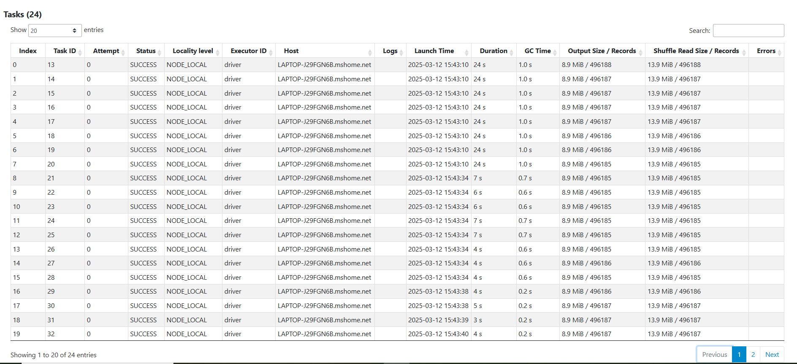

## Table of Contents

- []()


### Introduction to Batch Processing

[YT Link](https://www.youtube.com/watch?v=dcHe5Fl3MF8&list=PL3MmuxUbc_hJed7dXYoJw8DoCuVHhGEQb&index=44)

There are two ways to process data:
1. Batch 
2. Stream 

#### Batch v/s Stream 

| Criteria                           | Batch Processing                                                                                                    | Stream Processing                                                                          |
|------------------------------------|---------------------------------------------------------------------------------------------------------------------|--------------------------------------------------------------------------------------------|
| The Nature of the Data             | Processed gradually in batches.                                                                                     | Processed continuously in a stream.                                                        |
| Processing Time                    | On a set schedule.                                                                                                  | Constant processing.                                                                       |
| Complexity                         | Simple, as it deals with finite and predetermined data chunks.                                                      | Complex, as the data flow is constant and may lead to consistency anomalies.               |
| Hardware Requirements              | Varies but can be performed by lower-end systems as well as high-end systems.                                       | Demanding while also requiring that the system be operational at all times.                |
| Throughput                         | High. Batch processing is intended for large amounts of data, and as such, it is optimized with that goal in mind.  | Varies depending on the task at hand.                                                      |
| Application                        | Email campaigns, billing, Invoicing, scientific research, image processing, video processing, etc.                  | Social media monitoring, fraud detection, healthcare monitoring, network monitoring, etc.  |
| Consistency & Completeness of Data | Data consistency and completeness are usually uncompromised upon processing.                                        | Higher potential for corrupted data or out-of-order data.                                  |
| Error Recognition & Resolution     | Errors can only be recognized and resolved after the processing is finished.                                        | Errors can be recognized and resolved in real-time.                                        |
| Input Requirements                 | In batch processing, inputs are static and preset.                                                                  | In stream processing, inputs are dynamic.                                                  |
| Available Tools                    | Py Scripts, Apache Hive, Apache Spark, Apache Hadoop.                                                                           | Apache Kafka, Apache Storm, Apache Fink.                                                   |
| Latency                            | High latency, as insight becomes available only after the processing of the batch finishes.                         | Low Latency, with insights being available instantaneously.                                |


#### Advantages of Batch jobs:

- Easy to manage. 
- Re-execution is possible in case of failures.
- Scale up is easy. 

#### Disadvantages of Batch jobs:

- Delay in ingestion 


### Introduction to Spark

[YT Link](https://www.youtube.com/watch?v=FhaqbEOuQ8U&list=PL3MmuxUbc_hJed7dXYoJw8DoCuVHhGEQb&index=45)

Spark is an open-source unified analytics, mulit-language engine for large scale data processing. It can run jobs in a cluster, which is basically, multiple running instances of spark, all performing different processing tasks on the source data. 

It's native language is Scala, but it offers *wrappers* that provide support for other languages as well, example,`PySpark` for Python. While it's more commonly used to execute batch processing jobs, it can be used for stream processing as well. In case of stream processing with Spark, the incoming stream of data is ingested in small `batches` so it's essentially creating a *psuedo batch* type flow.

When to use Spark?

- Datalake:
     DL     ->    SPARK   ->    DL
    (S3, GCS,
    parquet etc)

Note: If you can execute/express our job in SQL, then go with it. You can use tools like HIVE/Athena etc instead of Spark in such cases. 

### Installing Spark on Windows 

Follow the instructions [here](https://github.com/DataTalksClub/data-engineering-zoomcamp/blob/main/05-batch/setup/windows.md).

Checks:

**Validate JAVA installation.**

```shell

rimsh@LAPTOP-J29FGN6B MINGW64 ~
$ export JAVA_HOME="/c/tools/jdk-11.0.25_windows-x64_bin"

rimsh@LAPTOP-J29FGN6B MINGW64 ~
$ echo $JAVA_HOME
/c/tools/jdk-11.0.25_windows-x64_bin

rimsh@LAPTOP-J29FGN6B MINGW64 ~
$ export PATH="${JAVA_HOME}/bin:${PATH}"

rimsh@LAPTOP-J29FGN6B MINGW64 ~
$ java -version
java version "11.0.25" 2024-10-15 LTS
Java(TM) SE Runtime Environment 18.9 (build 11.0.25+9-LTS-256)
Java HotSpot(TM) 64-Bit Server VM 18.9 (build 11.0.25+9-LTS-256, mixed mode)

```

**wget and spark installation**

- Installed `wget` from [GNU wget for Windows](https://eternallybored.org/misc/wget/), saved it in program files and added it to Sys variables. 
- Install spark within the dir mentioned (c/tools/) and then run the tar command to unzip.. 
- Set the sys env variable correctly, it's under `c/spark-3.3.2-bin-hadoop3/spark-3.3.2-bin-hadoop3`. After you cd to this dir, run the `./bin/spark-shell.cmd` command. 

```shell
rimsh@LAPTOP-J29FGN6B MINGW64 /c/tools/spark-3.3.2-bin-hadoop3/spark-3.3.2-bin-hadoop3
$ ./bin/spark-shell.cmd
25/03/10 13:48:02 WARN Shell: Did not find winutils.exe: java.io.FileNotFoundException: java.io.FileNotFoundException: HADOOP_HOME and hadoop.home.dir are unset. -see https://wiki.apache.org/hadoop/WindowsProbl
ems
Setting default log level to "WARN".
To adjust logging level use sc.setLogLevel(newLevel). For SparkR, use setLogLevel(newLevel).
25/03/10 13:48:08 WARN NativeCodeLoader: Unable to load native-hadoop library for your platform... using builtin-java classes where applicable
Spark context Web UI available at http://LAPTOP-J29FGN6B:4040
Spark context available as 'sc' (master = local[*], app id = local-1741610890584).
Spark session available as 'spark'.
Welcome to
      ____              __
     / __/__  ___ _____/ /__
    _\ \/ _ \/ _ `/ __/  '_/
   /___/ .__/\_,_/_/ /_/\_\   version 3.3.2
      /_/

Using Scala version 2.12.15 (Java HotSpot(TM) 64-Bit Server VM, Java 11.0.25)
Type in expressions to have them evaluated.
Type :help for more information.

scala>
```
  
**Note: Ensure that the paths `JAVA_HOME` and `SPARK_HOME` are set correctly. Manually set it if need be.**

**pyspark installation**

- Ran `pip install pyspark` 

- For the SPARK_HOME, JAVA_HOME, and PYTHONPATH variables to persist, I manualy set it in ENV variables under system variables > New. 

- Then I set the assoicated paths in PATH as well. 

```shell
rimsh@LAPTOP-J29FGN6B MINGW64 ~
$ echo $SPARK_HOME
echo $JAVA_HOME
echo $PYTHONPATH
C:\tools\spark-3.3.2-bin-hadoop3
C:\tools\jdk-11.0.25_windows-x64_bin\jdk-11.0.25
C:\tools\spark-3.3.2-bin-hadoop3\python\lib\py4j-0.10.9.5-src.zip
```
- Upon completing the above setup, pyspark worked. 


**Explanation of the above script: [pyspark_test_script.ipynb](../scripts/pyspark_test_script.ipynb)**

```python
import pyspark
from pyspark.sql import SparkSession
```
SparkSession is the entry point to programming with Spark, and it allows you to interact with Spark through its DataFrame API.

```python
spark = SparkSession.builder \
    .master("local[*]") \
    .appName('test') \
    .getOrCreate()
```

`SparkSession.builder`: This is a builder pattern for creating a SparkSession.

- `master("local[*]")`: This specifies the master URL for the Spark cluster. In this case, it is set to "local[*]", which means that Spark will run locally using as many cores as available on your machine (* indicates all available cores).
- `appName('test')`: This sets the name of your Spark application to "test". This name will be shown in the Spark UI and can be used for logging and monitoring purposes.
- `getOrCreate()`: This either returns an existing SparkSession if one exists or creates a new one. It's important because Spark can only have one active SparkSession per JVM (or Python process), so you use getOrCreate() to ensure you’re reusing the existing one or creating a new one as needed.
This step creates or retrieves a SparkSession object, which is the entry point for working with DataFrames and interacting with the Spark cluster.

```python
df = spark.read \
    .option("header", "true") \
    .csv('taxi_zone_lookup.csv')
df.show()

```
- `spark.read`: This is the DataFrameReader from the SparkSession, which provides methods to read data from various sources like CSV, Parquet, JSON, and more.
- `option("header", "true")`: This sets an option for reading the CSV file. By default, Spark assumes the first row of the CSV file is data. The option "header", "true" tells Spark that the first row of the CSV file contains column headers (i.e., column names) and should be used as such.
- `csv('taxi_zone_lookup.csv')`: This specifies the path to the CSV file to be read. In this case, it’s reading a file named taxi_zone_lookup.csv. Spark will read this CSV file into a DataFrame.
- `df.show()`: This command displays the first 20 rows of the DataFrame in a tabular format in the console. The show() method provides a quick view of the data and is useful for debugging and inspecting the content of the DataFrame.

**Output in Spark:**

Spark launches a web UI on the port 4040, by default. 


#### Why use PySpark over Pandas?

I can do the same using Python Pandas as well, but there are some crucial differences between the two. 

1. `Handling Large Datasets (Big Data)`
pandas is great for working with data that fits into memory. It is efficient and easy to use when the dataset is small or moderate in size (fits into your system's memory).

PySpark, on the other hand, is designed for big data and works with distributed computing. When your dataset is too large to fit into the memory of a single machine (or if you want to scale your work across a cluster of machines), PySpark allows you to distribute data and computations across many nodes, making it much more scalable than pandas.

Example: With PySpark, you can process terabytes or petabytes of data in parallel across multiple machines. With pandas, you'd likely hit memory issues when trying to load a dataset larger than your available RAM.

2. `Distributed Computing`
pandas operates in a single-threaded, non-distributed manner. All operations in pandas are performed on your local machine's memory (RAM).

PySpark operates on distributed clusters. It splits your data into smaller chunks, processes them in parallel across many machines, and then combines the results. This is known as MapReduce, where Spark distributes the work and handles fault tolerance, recovery, and parallelism automatically.

Example: When reading large datasets (e.g., a 500GB file), pandas will struggle to load this into memory. In contrast, PySpark will read and distribute the data across multiple machines in a cluster, so you can process the entire dataset without running out of memory.

3. `Fault Tolerance`
pandas doesn’t have built-in fault tolerance. If your script or machine crashes during processing, you'll need to restart from scratch.

PySpark is fault-tolerant. It uses Resilient Distributed Datasets (RDDs), which allow it to recover from node failures by tracking the operations on data and recomputing missing parts if needed. This is crucial in large-scale data processing, where failures can happen due to the size of the data or hardware issues.

4. `Advanced Spark Capabilities (SQL, Machine Learning, Streaming)`
pandas is mainly a data manipulation library. While it is extremely powerful for data exploration, cleaning, and analysis, it doesn't have built-in tools for distributed machine learning or streaming data.

PySpark offers several advanced features:

Spark SQL: Allows you to run SQL queries on your data, making it easier to work with large structured data.
MLlib: A machine learning library that supports scalable machine learning algorithms (e.g., classification, regression, clustering).
Structured Streaming: For real-time data processing, allowing you to process streams of data as they arrive, making it suitable for tasks like log processing or real-time analytics.
GraphFrames: For graph processing (e.g., for network analysis, social media graphs, etc.).

5. `Scalability`
pandas is great for individual or small-scale data analysis on your local machine, but it doesn't scale out to clusters. When your dataset grows or if you want to process data in parallel, it doesn't have the ability to leverage multiple machines or cores efficiently.

PySpark is designed for horizontal scalability. It can scale from a single machine (for smaller workloads) to a large cluster of hundreds or thousands of machines. This is key when working with very large datasets that exceed the capabilities of a single machine.

6. `Integration with Hadoop Ecosystem`
pandas operates independently, so if you're working with big data stored in distributed systems like Hadoop HDFS, Amazon S3, or Google Cloud Storage, you'd need additional tools or libraries to interact with these systems.

PySpark integrates directly with the Hadoop ecosystem and distributed storage systems like HDFS, S3, and others. It allows you to read from and write to these storage systems in a distributed fashion, making it a powerful tool for working with large datasets stored in the cloud or on distributed file systems.


| Use Case                        | pandas                                                 | PySpark                                           |
|---------------------------------|--------------------------------------------------------|---------------------------------------------------|
| Small to medium datasets        | Excellent for small to medium data that fits in memory | Overkill; use pandas instead                      |
| Big Data (too large for memory) | Struggles with large datasets; may run out of memory   | Excellent for large-scale, distributed processing |
| Parallel/Distributed Processing | Single-threaded, non-parallel                          | Distributed parallel computation across a cluster |
| Fault tolerance                 | No built-in fault tolerance                            | Built-in fault tolerance (RDDs)                   |
| Real-time data processing       | Not suited for real-time                               | Structured Streaming for real-time data           |
| Machine Learning                | Limited to smaller datasets                            | MLlib for distributed machine learning            |
| SQL Support                     | Basic support with pandasql or SQLite                  | Full SQL support with Spark SQL                   |


### First Look at Spark/PySpark

[YT Link](https://www.youtube.com/watch?v=r_Sf6fCB40c&list=PL3MmuxUbc_hJed7dXYoJw8DoCuVHhGEQb&index=47)

**Explanation of the script: [pyspark_pandas.ipynb](../scripts/pyspark_pandas_1.ipynb)**

```python
import pyspark
from pyspark.sql import SparkSession
spark = SparkSession.builder \
    .master("local[*]") \
    .appName('test') \
    .getOrCreate()
```
Check the notes from pyspark_test_script.ipynb() for this. 

```python
!wget https://github.com/DataTalksClub/nyc-tlc-data/releases/download/fhvhv/fhvhv_tripdata_2021-01.csv.gz
```
The above code uses the `wget` command (with `!` to run it in Jupyter) to download a gzipped CSV file from GitHub. Here's what it does:

1. `!` - Allows running shell commands directly in a Jupyter notebook cell
2. `wget` - A command-line utility for downloading files from the internet
3. The URL points to a compressed CSV file containing NYC For-Hire Vehicle (FHV) trip data for January 2021

```python
!gzip -dc fhvhv_tripdata_2021-01.csv.gz > fhvhv_tripdata_2021-01.csv
```
This command uses the `gzip` utility to decompress a compressed file. Here's what each part does:

1. `!` - In Jupyter Notebook, this symbol allows you to run shell commands
2. `gzip` - The compression/decompression utility
3. `-dc` - Flags where:
   - `d` means decompress
   - `c` means write to standard output
4. `fhvhv_tripdata_2021-01.csv.gz` - The input compressed file
5. `>` - Redirects the output
6. `fhvhv_tripdata_2021-01.csv` - The output decompressed file

```python
df = spark.read \
    .option("header", "true") \
    .csv('fhvhv_tripdata_2021-01.csv')
```
Read the csv unzipped in the previous step, and make sure to add "header", "true" so the first row is identified as a header. 

```python
df.schema
```
**Ouput:**
StructType([StructField('hvfhs_license_num', StringType(), True), StructField('dispatching_base_num', StringType(), True), StructField('pickup_datetime', StringType(), True), StructField('dropoff_datetime', StringType(), True), StructField('PULocationID', StringType(), True), StructField('DOLocationID', StringType(), True), StructField('SR_Flag', StringType(), True)])

One thing to note here is, Spark doesn't infer data types automatically , so everything is treated as a string by default.

```python
!head -n 1001 fhvhv_tripdata_2021-01.csv 
```
Displys the first 1001 rows from the compressed, unzipped file. 

```python
import pandas as pd
df_pandas = pd.read_csv('head.csv')
df_pandas.dtypes
```

Then we load the first 1001 records into `head.csv`. 


```python
spark.createDataFrame(df_pandas).schema #pandas dataframe input -> spark dataframe output
```
**output**
StructType([StructField('hvfhs_license_num', StringType(), True), StructField('dispatching_base_num', StringType(), True), StructField('pickup_datetime', StringType(), True), StructField('dropoff_datetime', StringType(), True), StructField('PULocationID', LongType(), True), StructField('DOLocationID', LongType(), True), StructField('SR_Flag', DoubleType(), True)])

Now, we'll redefine the schema:

```scala
schema = types.StructType([
    types.StructField('hvfhs_license_num', types.StringType(), True),
    types.StructField('dispatching_base_num', types.StringType(), True),
    types.StructField('pickup_datetime', types.TimestampType(), True),
    types.StructField('dropoff_datetime', types.TimestampType(), True),
    types.StructField('PULocationID', types.IntegerType(), True),
    types.StructField('DOLocationID', types.IntegerType(), True),
    types.StructField('SR_Flag', types.StringType(), True)
])
```

The above schema definition includes `StructType` which comes from Scala. Before running this in the ipynb file, import types by running the code 

```python 
from pyspark.sql import types
```

Next, you have to specify the above schema when trying to `read` the file as a `Spark Object`

```python 
df = spark.read \
    .option("header", "true") \
    .schema(schema) \
    .csv('fhvhv_tripdata_2021-01.csv')
```

The `schema` is passed as a parameter to the `spark.read` function. You can see the output by running the below code:

```python
df.dtypes
```
**output**

[('hvfhs_license_num', 'string'), <br>
 ('dispatching_base_num', 'string'), <br>
 ('pickup_datetime', 'timestamp'), ,<br>
 ('dropoff_datetime', 'timestamp'), <br>
 ('PULocationID', 'int'), <br>
 ('DOLocationID', 'int'), <br>
 ('SR_Flag', 'string')]

 I want to now import it as a parquet file instead because of the benefits of parquet over csv. 
 Expand the below <details><summary> parquet v/s csv </summary>
 <table>
  <thead>
    <tr>
      <th>Feature</th>
      <th>Parquet 🏆 (Preferred)</th>
      <th>CSV 📄 (Basic)</th>
    </tr>
  </thead>
  <tbody>
    <tr>
      <td><strong>Storage Format</strong></td>
      <td>Columnar (efficient)</td>
      <td>Row-based (inefficient)</td>
    </tr>
    <tr>
      <td><strong>Performance</strong></td>
      <td>Fast (optimized for big data)</td>
      <td>Slow (reads entire file)</td>
    </tr>
    <tr>
      <td><strong>Compression</strong></td>
      <td>High (Snappy, Gzip)</td>
      <td>Low (plain text)</td>
    </tr>
    <tr>
      <td><strong>Schema Support</strong></td>
      <td>Strong types, schema evolution</td>
      <td>Everything is a string</td>
    </tr>
    <tr>
      <td><strong>Big Data Tools</strong></td>
      <td>Optimized (BigQuery, Spark)</td>
      <td>Not optimized</td>
    </tr>
    <tr>
      <td><strong>Handling Large Data</strong></td>
      <td>Efficient (parallel reads, partitioning)</td>
      <td>Inefficient for large files</td>
    </tr>
    <tr>
      <td><strong>Use Case</strong></td>
      <td>Analytics, cloud storage</td>
      <td>Small datasets, human-readable</td>
    </tr>
  </tbody>
</table>

 </details>

#### Partitions

So here we have one huge CSV/Parquet file, and actually, having just one file is not good.

Imagine that this is our Spark cluster, and inside the Spark cluster, we have a bunch of `executors`. These are computers that are actually doing computational work. They pull the files from our data lake and perform computations. In the below picture, you can see that since we have only one large file, only one executor can process it, while the others remain idle.


This is inefficient, so we want multiple smaller files instead of one large file.


These smaller units of the file are called `partitions`. To achieve this, Spark has a special command called 
`df.repartition()`, which takes the number of partitions as a parameter. When we read a file into a DataFrame, Spark creates as many partitions as there are files in the folder.

Executing `df.repartition(24)` does not immediately change the DataFrame because repartitioning is lazy. The change is applied only when we perform an action, such as saving the DataFrame. So, let's save it as Parquet file/write it into a dataframe. (Check [pyspark_pandas_1.ipynb](../scripts/pyspark_pandas_1.ipynb))

```python 
df = df.repartition(24)
df.write.parquet('fhvhv/2021/01')
```

When we execute this, Spark starts processing. We can see the job in the Spark UI under "Parquet." Clicking on it reveals the partitioning process. The operation is quite expensive, so it takes some time to complete.


As you can see above, the files are partitioned. 



This is the summary metrics and status of the partitioning job in SPARK. 

### Spark DataFrames

[YT Link](https://www.youtube.com/watch?v=ti3aC1m3rE8&list=PL3MmuxUbc_hJed7dXYoJw8DoCuVHhGEQb&index=48)

```python
df = spark.read.parquet("fhvhv/2021/01")
```
Now we're reading from the parquet file partitioned in the folder. 

```python 
df.printSchema()
```
Rechecking to make sure the datatypes are correctly set up. 

So, what can we do with a spark dataframe?

1. Selected columns + Action on that column : 
  
    `df.select('pickup_datetime','dropoff_datetime','PULocationID', 'DOLocationID').filter(df.hvfhs_license_num=="HV0003")`

    It will display only the specified columns, filtered by the `hvfhs_license_num` column. Add `.show()` to display the table:

    `df.select('pickup_datetime','dropoff_datetime','PULocationID', 'DOLocationID').filter(df.hvfhs_license_num=="HV0003").show()`

    Note that before adding show(), spark will not execute the above. These are `lazy` jobs. It will not be executed right away, just like repartitioning. In Spark, there is a distinction between operations that are executed right away and those that are deferred. These are called `actions and transformations`. 

    Transformations: Transformations are operations that do not execute right away. These operations create a sequence of transformations that Spark tracks internally. Spark does not execute anything immediately. Instead, it builds a logical plan of transformations. For example:

    - select 
    - filtering
    - functions 
    - joins, group by

    However, when we call an action like .show(), Spark evaluates the entire transformation sequence and executes the computation. At this point, Spark processes all previous transformations and returns the result

    Actions: Occur immediately/trigger execution. 

    - show(): Displays the DataFrame.
    - take(5)/head(5): Retrieves the first five records. 
    - write.csv() or write.parquet() – Triggers execution to write results to storage.

2. Built in functions in Spark: 

    In Spark, we have pyspark.sql.functions, a collection of functions that Spark provides. To use them, we typically import them as follows:

    `from pyspark.sql import functions as F`

    Using F, we can explore available functions by typing F. and pressing Tab. There are many built-in functions.

    One useful function is to_date(), which extracts only the date from a datetime column, discarding hours, minutes, and seconds.

    We can also use `withColumn()` to create new columns. For example:

    ```python
    df \
        .withColumn("pickup_date", F.to_date(df.pickup_datetime)) \
        .withColumn("dropoff_date", F.to_date(df.dropoff_datetime)) \
        .show()    
    ```
    This code performs the following operations:

    Creates a new column named "pickup_date". Converts the "pickup_datetime" column into a date format using F.to_date().

    Creates another new column named "dropoff_date". Converts the "dropoff_datetime" column to a date format, similar to the previous step. If we use a column name that already exists, Spark overwrites it.

    Finally, we can add a select():

    ```python
    df \
        .withColumn("pickup_date", F.to_date(df.pickup_datetime)) \
        .withColumn("dropoff_date", F.to_date(df.dropoff_datetime)) \
        .select("pickup_date","dropoff_date","PULocationID","DOLocationID") \
        .show()    
    ```

3. User defined functions: 

    Let's say we have a function `xyz()`  that performs complex logic, something not easy to express with SQL. We'll write a python function, with the usual syntax. and then turn it into a UDF in PySpark:

    ```python
    def xyz():
    {
      ...
    }

    xyzf_udf = F.udf(xyz, returnType=types.StringType()) # it can be any returntype.
    ```
    ```python

    df.withcolumn('output_column', xyz_udf(df.input_column)) # will create a column based on the output from the xyz() function in the spark df 
    
    ```
### Troubleshooting 

1. `ConnectionRefusedError: [WinError 10061] No connection could be made because the target machine actively refused it`

    Got this error on trying to run `pyspark_pandas.ipynb`. 

    Steps:

    - Check if $SPARK_HOME, $JAVA_HOME and $PYTHONPATH are correctly set up. 

    I found that perhaps an anaconda installation of PySpark was clashing with this. So, I modified ENV variables, and moved the anaconda installation below the spark installation in the edit list (it gets less priority). 

    ```shell 
    rimsh@LAPTOP-J29FGN6B MINGW64 ~
    $ where pyspark
    C:\tools\spark-3.3.2-bin-hadoop3\bin\pyspark
    C:\tools\spark-3.3.2-bin-hadoop3\bin\pyspark.cmd
    C:\Users\rimsh\anaconda3\Scripts\pyspark
    C:\Users\rimsh\anaconda3\Scripts\pyspark.cmd
    ```

    And after this, I restarted the Jupyter notebook kernel, and it worked.

2. Got an error on running the code - `df.write.parquet('fhvhv/2021/01')` in pyspark_pandas.ipynb.

    Message Displayed - `Caused by: java.io.FileNotFoundException: HADOOP_HOME and hadoop.home.dir are unset.`
    Solution: 
    - Set sys env variable HADOOP_HOME and assign the value - `C:\tools\hadoop-3.2.0` to it. 
    - Set it in the $PATH under SYS variables. 

3. Faced other issues + depedency errors: Downgraded python and pandas because the python installed on my system is of 3.13 version which is not compatible with other installations of pyspark, java, hadoop, spark etc. I created a conda env `pyspark_env` (running python version 3.10.*) and in that env, I removed/uninstalled existing pandas (version>2) and numpy (version>2), then reinstalled `pandas 1.5.3` and `numpy 1.23.5` respectively. 